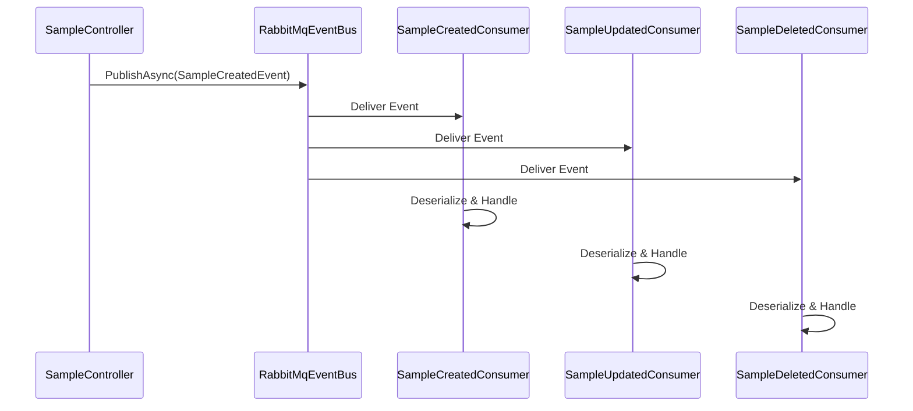
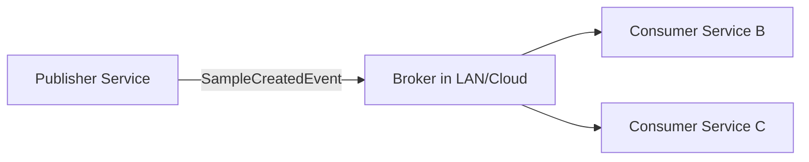
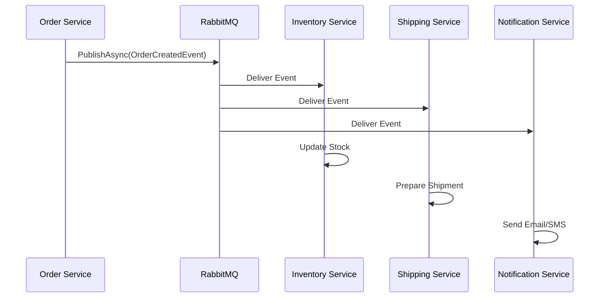

# Messaging — Event-Driven Architecture

## Table of Contents

- [1. Event-Driven Messaging](#1-event-driven-messaging)
- [2. Our Event-Driven Template — How It Works](#2-our-event-driven-template--how-it-works)
- [3. Flow Diagram — Local Template](#3-flow-diagram--local-template)
- [4. Scaling Beyond Local — Distributed Use Case](#4-scaling-beyond-local--distributed-use-case)
- [5. Why RabbitMQ Was Chosen](#5-why-rabbitmq-was-chosen)
- [6. Real-World Example — Order Processing System](#6-real-world-example--order-processing-system)
- [7. Hybrid REST + Event-Driven Approach](#7-hybrid-rest--event-driven-approach)

## 1. Event-Driven Messaging

In synchronous communication, a service calls another service directly (usually via HTTP REST) and waits for a response. It's useful when a client needs an immediate response. 
However, it also introduces several drawbacks:

* Tightly coupled services — the service A must know about the service B.
* Slower response if the service B is busy or fails, causing service A to become slow or temporarily unresponsive.
* Harder to scale when multiple services need to react to the same action.

**Event-driven architecture** solves this by allowing services to **publish events** that describe something that happened, without caring who consumes it. Consumers subscribe to the events and react asynchronously.

Key benefits:

* **Loose coupling:** Publishers do not need to know who is listening.
* **Asynchronous processing:** Requests are not blocked by other operations.
* **Scalability:** New consumers can be added without changing the publisher.
* **Resilience:** Failures in consumers do not affect the main request.

> In our template, the event bus is **local to the service**, making it simple to run and test. Later, it can easily extend to a distributed event setup.


## 2. Our Event-Driven Template — How It Works

This template uses an **event-driven approach** to allow parts of the system to react to important actions asynchronously.

When a business operation completes (for example creating, updating, or deleting a resource), the application publishes an **event** describing what happened. Other components can subscribe to that event and run additional logic independently.

The messaging implementation itself exists in the [Infrastructure Layer](overview.md#infrastructure-layer).
The rest of the application simply interacts with the event bus.

For reference, the [Application layer](overview.md#application-layer) exposes the following event bus definition used throughout the template:

```csharp
namespace ServiceName.Application.Interfaces;

public interface IEventBus
{
    Task PublishAsync<T>(T message);
    Task Subscribe<T>(Func<T, Task> handler);
}
```

This is the entry point used by controllers and background consumers to publish and receive events.


### Publishing Events

In the template, events are usually published **after the main business operation succeeds**.

For example, the controller publishes an event after creating a new resource.

```csharp
var id = await _service.AddAsync(dto);

await _eventBus.PublishAsync(
    new SampleCreatedEvent(id));
```

Conceptually the flow is:

```
Client Request
      │
      ▼
Controller
      │
      ▼
Application Service
      │
      ▼
Database Operation
      │
      ▼
Publish Event
      │
      ▼
Messaging Infrastructure
```

The controller only signals that an action occurred.
Any additional processing happens asynchronously through event consumers.


### Event Consumers

Consumers subscribe to specific events and run logic when those events occur.

They typically run as **background services** declared in the Infrastructure Layer and continuously listen for incoming events.

Examples of tasks handled by consumers include:

* sending notifications
* updating analytics
* writing audit logs
* updating caches

Conceptually:

```
Messaging Infrastructure
        │
        ▼
Background Consumer
        │
        ▼
Event Handling Logic
```

Because this processing happens outside the request pipeline, it does not affect API response time.


### Overall Event Flow

```
Controller
   │
   ▼
Business Operation
   │
   ▼
Publish Event
   │
   ▼
Messaging Infrastructure
   │
   ▼
Event Consumers
```

This structure allows the system to react to events **without tightly coupling components together**, making it easier to extend and scale.

### Dependency Injection Registration

The event bus implementation is registered in the [Dependency Injection](request-flow.md#8-dependency-injection) container during application startup as part of the infrastructure setup.

The API project wires all infrastructure components through the AddInfrastructure extension method.

Conceptually:

```
Program.cs
    │
    ▼
AddInfrastructure()
    │
    ▼
RabbitMQ Messaging Setup
    │
    ▼
Event Bus Registered in DI Container
```

This allows ASP.NET Core to automatically provide the Event Bus wherever it is required, such as in controllers that publish events or background services that subscribe to them.


## 3. Flow Diagram — Local Template



**Explanation:**

* All consumers are **inside the same service instance**.
* Low latency, perfect for single-service workflows.
* Demonstrates **loose coupling and asynchronous processing**.


## 4. Scaling Beyond Local — Distributed Use Case



**Explanation:**

* Publisher does not care **where consumers are located**.
* Can scale across multiple machines, regions, or cloud services.
* Supports retries, dead-letter queues, and distributed logging.


## 5. Why RabbitMQ Was Chosen

Other messaging technologies such as Kafka, cloud-native messaging services, or managed event buses were not included in this template.

The goal of this template is to demonstrate **microservice architecture patterns** rather than platform-specific infrastructure.

RabbitMQ provides a good balance between simplicity and real-world capability while remaining easy to run locally.

## 6. Real-World Example — Order Processing System

**Scenario:** An e-commerce platform where multiple services must react to order creation.



**Explanation:**

* Controller responds **immediately** to the client.
* Inventory, Shipping, Notification services handle events independently.
* Adding a new service (e.g., Analytics) requires **just subscribing** to the event.
* Demonstrates **decoupled, scalable, and asynchronous workflow** in the real world.


## 7. Hybrid REST + Event-Driven Approach

In practice, most microservices use **both REST and Event-Driven messaging**:

* **REST:** Used for synchronous operations where a client expects an immediate response (e.g., fetching user data).
* **Event-Driven:** Used for asynchronous workflows, background processing, or notifying multiple consumers (e.g., order created, email notification).

**Why hybrid is necessary:**

* Some workflows are inherently **synchronous**, requiring REST.
* Others are **asynchronous**, where events decouple services.
* Combining both provides flexibility, performance, and reliability.

**Example:**

* Create an order → REST API responds immediately with confirmation.
* Then publish `OrderCreatedEvent` → Inventory, Shipping, and Notification services process asynchronously.

> This ensures **fast client responses** and **scalable backend processing** simultaneously.

For more information on hybrid approach, you can refer to the article **[Communication in a microservice architecture](https://learn.microsoft.com/en-us/dotnet/architecture/microservices/architect-microservice-container-applications/communication-in-microservice-architecture)** from **Microsoft**.


