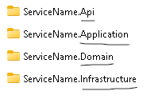
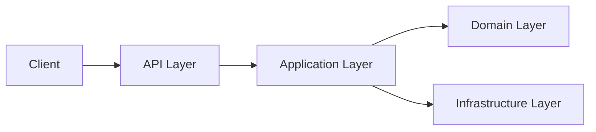
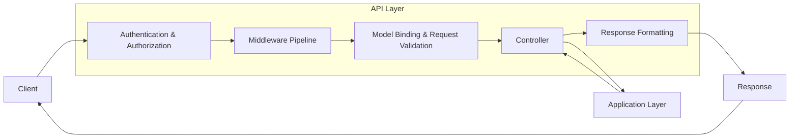
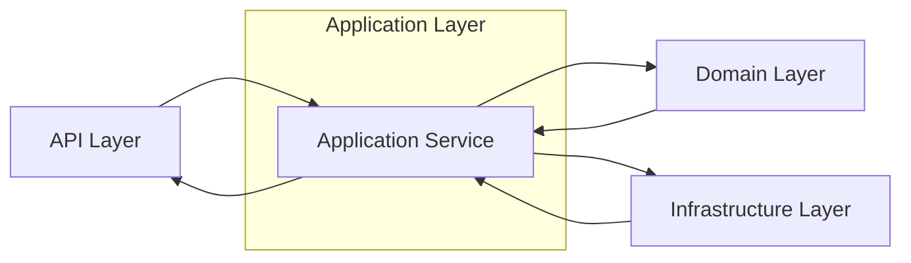
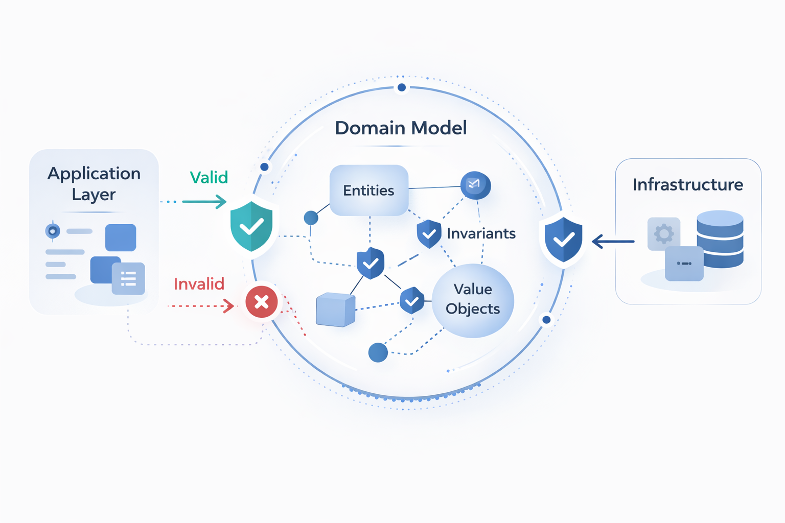
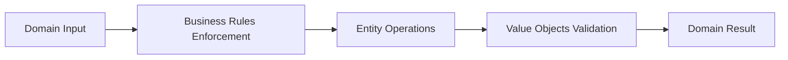
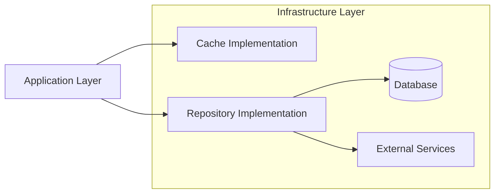

# Service Architecture Overview

## Table of Contents

- [1. Is Clean Architecture Worth the Extra Effort?](#1-is-clean-architecture-worth-the-extra-effort)
- [2. Layered Structure and Responsibilities](#2-layered-structure-and-responsibilities)
- [3. Dependency Rule](#3-dependency-rule)
- [4. Applicability](#4-applicability)

## 1. Is Clean Architecture Worth the extra effort?

<p align="center">
  
</p>

### Purpose of Clean Architecture in This Template

* The goal of this template is to provide clear separation of concerns, maintainability, and testability for microservices and service-oriented architectures.
* Clean Architecture isolates business logic from frameworks, databases, and external services, keeping the core domain stable even when technologies change.


### Why Separation of Concerns Matters

* In real projects, requirements change frequently.
* If business logic is tightly coupled with infrastructure, even small changes can affect multiple parts of the system.
* This leads to code duplication, unintended side effects, and harder debugging.
* Poor separation can also expose internal implementation details outside the service.


### Benefits of Proper Segregation

* Business logic remains protected inside core layers.
* External layers interact only through well-defined interfaces.
* Implementation details are hidden from the outside world.
* The system remains readable and maintainable as it grows.
* Changes become safer and more predictable.


### Long-Term Advantages

* Infrastructure components (databases, messaging systems, frameworks) can be replaced without rewriting core logic.
* Controllers remain thin and focused on request handling.
* Testing becomes easier because business rules are independent of external dependencies.
* The architecture scales better as the service evolves.


## 2. Layered Structure and Responsibilities

The template uses four primary layers (But can added depending on requirements, like Handler in CQRS pattern, etc.):





### API Layer

<p align="center">
  
</p>

The API layer is the entry point of the service. It receives requests from clients, performs initial checks, and forwards valid requests to the Application layer for processing. Once the Application layer completes the operation, the API layer returns an appropriate response to the client. It should not contain business logic.

You can think of it as a gatekeeper — it verifies requests, enforces security policies, and ensures only valid requests reach the business logic.

The API layer typically includes the following responsibilities:

* **Controllers** — Define HTTP endpoints and route requests to the appropriate application services
* **Middleware** — Intercepts requests for cross-cutting concerns such as logging, exception handling, and security checks before they reach controllers
* **Request validation** — Ensures incoming data is well-formed and meets expected constraints
* **Response formatting** — Shapes the output returned to the client (status codes, response models, error structures)
* **Authentication and authorization enforcement** — Verifies identity and permissions to prevent unauthorized access



### Application Layer

<p align="center">
  
</p>

The Application layer works like a service desk or agent that coordinates requests between external users and internal departments. Its role is to receive structured requests from the API layer, translate them into operations understood by the core business logic, and orchestrate the steps required to fulfill the request.

Clients do not need to know how the system processes their request internally — they only care about the result. The Application layer acts as the middleman that prepares data in the correct format, invokes domain operations, and returns the outcome in a form suitable for external consumption.

It contains the system’s use cases and orchestration logic.

The Application layer typically includes:

* **Application services** — Implement use cases and coordinate domain operations
* **DTO definitions** — Define data contracts exchanged between layers
* **Interfaces for infrastructure dependencies** — Abstract repositories, messaging systems, and external services
* **Business workflow coordination** — Manage the sequence of operations required to complete a request
* **Validation and mapping** — Transform external data into domain entities and vice versa



### Domain Layer

<p align="center">
  
</p>

The Domain layer is the core of the application and represents the fundamental business model. It defines what the system is allowed to do, the rules that must always be enforced, and the meaning of the data being processed.

You can think of it as the source of truth for business behavior — it determines what actions are valid, how they should behave, and what constraints must never be violated.

All other layers exist to support and execute the logic defined here.

The Domain layer typically includes:

* **Entities** — Objects with identity that represent core business concepts
* **Value objects** — Immutable objects defined by their attributes rather than identity
* **Enumerations** — Well-defined sets of allowed values
* **Business rules** — Invariants and policies that govern domain behavior



### Infrastructure Layer

<p align="center">
  
</p>


The Infrastructure layer is responsible for implementing the technical and external concerns required to support the application. While the Domain layer defines business rules and the Application layer orchestrates use cases, the Infrastructure layer handles the concrete details needed to make those operations work in the real world.

You can think of it as the technical engine room of the system — it connects the application to databases, external services, messaging systems, caching providers, and other integrations. It does not define business rules, but it executes the operations required to persist, retrieve, or transmit data according to those rules.

Because this layer contains implementation details and integration logic, it remains isolated from clients and is accessed only through interfaces defined in the Application layer.

The Infrastructure layer typically includes:

* **Database access** — Entity Framework or other ORM implementations
* **Repository implementations** — Concrete implementations of application-defined interfaces
* **Messaging integrations** — Message brokers, event bus implementations
* **Caching providers** — Redis or distributed cache implementations
* **External service clients** — HTTP clients, third-party APIs
* **Security implementations** — Token providers, encryption, hashing mechanisms




## 3. Dependency Rule

All dependencies must point inward toward the Domain layer.

```
API → Application → Domain ← Infrastructure
```

This means:

* The Domain layer does not depend on frameworks, databases, or external services.
* The Application layer depends only on Domain abstractions.
* The Infrastructure layer implements interfaces defined by the Application layer.
* DTOs are used between layers to prevent direct exposure of Domain entities.
* No layer outside the Domain can introduce business rules.

By enforcing inward dependencies, the core business logic remains protected and stable even when external technologies change.


## 4. Applicability

This architectural structure is not limited to microservices.

It is suitable for:

* Microservices
* Modular monoliths
* Service-oriented architectures
* Enterprise applications

The key principle is separation of concerns.

By isolating business logic from infrastructure and frameworks, the system remains:

* Maintainable as it grows
* Easier to test
* Safer to modify
* Flexible to evolving technical requirements

Whether applied to a small service or a large distributed system, the same architectural boundaries help preserve clarity and long-term stability.
