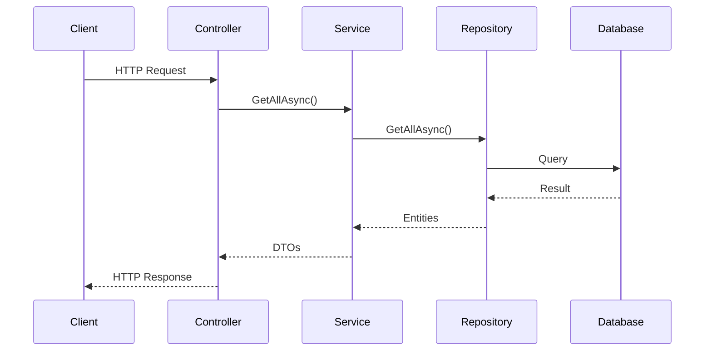

# CRUD Request Flow

This document explains how a CRUD request flows through the service layers defined in the [architecture overview](overview.md). The goal of this guide is to walk through the actual execution path of a request and explain why the structure of the code is organized this way.

## Table of Contents

- [1. Request Execution Overview](#1-request-execution-overview)
- [2. Controller – API Entry Point](#2-controller--api-entry-point)
- [3. Application Service](#3-application-service)
- [4. DTO and Domain Model Separation](#4-dto-and-domain-model-separation)
- [5. Repository Layer](#5-repository-layer)
- [6. Database Context](#6-database-context)
- [7. Database Migrations](#7-database-migrations)
- [8. Dependency Injection](#8-dependency-injection)
- [9. Interface Contracts](#9-interface-contracts)
- [10. Interface vs Abstract Class](#10-interface-vs-abstract-class)


## 1. Request Execution Overview



A request always enters through the **API layer**, moves through the **Application layer**, and eventually reaches the **Infrastructure layer** where database interaction occurs. Once the required data is retrieved or modified, the response travels back through the same layers until it is returned to the client.

Each layer performs a clearly defined responsibility and communicates with other layers through interfaces.


## 2. Controller – API Entry Point

The controller is part of the [API layer](overview.md#api-layer) and acts as the entry point for HTTP requests. Its role is to receive incoming requests, route them to the appropriate application service, and return the result to the client.

Controllers should remain thin and should not contain business logic or database access logic. Keeping controllers lightweight ensures that HTTP concerns remain separate from business logic.

Example controller:

```csharp
[ApiController]
[Route("api/v1/samples")]
public class SampleController : ControllerBase
{
    private readonly ISampleService _service;

    public SampleController(ISampleService service)
    {
        _service = service;
    }
}
```

Example endpoint:

```csharp
[HttpGet]
public async Task<IActionResult> GetAllAsync()
{
    var result = await _service.GetAllAsync();
    return Ok(result);
}
```

### Why this matters

If controllers start implementing business logic, they quickly become tightly coupled to application behavior. This makes the system harder to maintain, test, and extend. By delegating logic to services, controllers remain focused on HTTP communication.


## 3. Application Service

After the controller receives the request, the processing moves to the **[Application layer](overview.md#application-layer)**. Application services implement use cases and coordinate the workflow required to complete a request.

Example service:

```csharp
public class SampleService : ISampleService
{
    private readonly IRepository<SampleEntity> _repository;

    public SampleService(IRepository<SampleEntity> repository)
    {
        _repository = repository;
    }
}
```

A typical service method retrieves entities from the repository and transforms them into DTOs before returning them to the controller.

```csharp
public async Task<IReadOnlyList<GetSampleRequestDto>> GetAllAsync()
{
    var entities = await _repository.GetAllAsync();

    return [.. entities.Select(x => new GetSampleRequestDto
    {
        Id = x.Id,
        Name = x.Name
    })];
}
```

### Why this matters

Application services define the **business workflow** of the system. By centralizing this logic in the Application layer, the system ensures that business rules are not scattered across controllers or repositories.

## 4. DTO and Domain Model Separation

DTOs (Data Transfer Objects) define the data exchanged between the API and external clients.

Example DTO:

```csharp
public class RequestDto
{
    public string Name { get; set; } = string.Empty;
}
```

[Domain](overview.md#domain-layer) entities represent the internal business model.

```csharp
public class SampleEntity
{
    public Guid Id { get; set; }
    public string Name { get; set; } = string.Empty;
}
```

### Why this matters

Domain entities often contain internal rules and additional properties that should not be exposed to external clients. DTOs allow the system to expose only the required fields while keeping the domain model internal to the service.


## 5. Repository Layer

The repository belongs to the [Infrastructure layer](overview.md#infrastructure-layer) and is responsible for performing persistence operations.

Example repository:

```csharp
public class SampleRepository(AppDbContext dbContext) : IRepository<SampleEntity>
{
    private readonly AppDbContext _dbContext = dbContext;

    public async Task<IReadOnlyList<SampleEntity>> GetAllAsync()
    {
        return await _dbContext.SampleEntities.ToListAsync();
    }
}
```

### Why this matters

The repository isolates database access from the Application layer. This allows the application logic to remain independent from the specific database implementation being used.


## 6. Database Context

Entity Framework Core is used to interact with the database. The structure of the database is defined using the application's DbContext.

```csharp
public class AppDbContext(DbContextOptions<AppDbContext> options) : DbContext(options)
{
    public DbSet<SampleEntity> SampleEntities => Set<SampleEntity>();
}
```

Each DbSet represents a table or collection of entities mapped to a database table.


## 7. Database Migrations

When the domain model changes, the database schema must also be updated. EF Core manages schema changes using migrations.

Create a migration using:

```
dotnet ef migrations add M01_InitialCreate \
  --project ServiceName.Infrastructure \
  --startup-project ServiceName.Api
```

Example generated migration file:

```
M01_InitialCreate.cs
```

### Migration Naming Convention

Migrations follow a numbered naming pattern:

```
M01_InitialCreate.cs
M02_AddSampleTable.cs
M03_AddIndexes.cs
```

### Why this matters

Using a numbered migration scheme makes it easier to track schema evolution and understand the order in which database changes were introduced.


## 8. Dependency Injection

ASP.NET Core uses a **Dependency Injection (DI) container** to manage object creation and dependency resolution.

Instead of creating dependencies manually inside classes, services are registered during application startup. The framework then automatically provides the required implementations whenever a class declares them in its constructor.


### Program.cs as the Composition Root

In this template, dependency configuration begins in Program.cs, which acts as the composition root of the application.

The composition root is the place where the entire application is assembled. All services, infrastructure components, and application dependencies are registered here so that the framework knows how to construct the objects required at runtime.

In modern ASP.NET Core applications, Program.cs uses top-level statements, which means the compiler automatically generates the entry point of the application. Internally, this behaves as if a Main method existed.

Conceptually, the application starts executing from something similar to:

Example startup configuration:

```csharp
public static void Main(string[] args)
{
    var builder = WebApplication.CreateBuilder(args);

    builder.Services.AddControllers();

    builder.Services.AddApplication();
    builder.Services.AddInfrastructure(builder.Configuration);

    var app = builder.Build();

    app.MapControllers();

    app.Run();
}
```
You will not see a `Main()` method in `Program.cs` because modern ASP.NET Core applications use **top-level statements**. 

With this feature, the code written in `Program.cs` becomes the application's entry point automatically. During compilation, the compiler generates the underlying `Main()` method and executes the statements defined in `Program.cs` from that entry point.

You may also see the following declaration in `Program.cs`:

```
public partial class Program {}
```
This allows the compiler-generated `Program` class to be extended and referenced from other projects. It is commonly included to support integration testing scenarios such as `WebApplicationFactory<Program>`.

When the application starts, ASP.NET Core builds the **Dependency Injection container** using the services registered in `Program.cs` and any extension methods it calls (such as `AddApplication()` or `AddInfrastructure()`).

Once the container is built, ASP.NET Core can construct controllers and other services by resolving their dependencies automatically.

```
Program.cs
   ↓
Service Registrations
   ↓
DI Container Built
   ↓
Application Starts
   ↓
Requests Begin Processing
```

### Application Layer Registration

Services belonging to the **Application layer** are registered inside the `AddApplication()` extension method.

Example:

```csharp
public static IServiceCollection AddApplication(this IServiceCollection services)
{
    services.AddScoped<ISampleService, SampleService>();
    return services;
}
```

This configuration tells the DI container:

> Whenever a component requires `ISampleService`, provide an instance of `SampleService`.


### Infrastructure Layer Registration

Infrastructure services such as repositories are registered inside `AddInfrastructure()`.

Example:

```csharp
services.AddScoped<IRepository<SampleEntity>, SampleRepository>();
```

This allows the Application layer to depend on the abstraction `IRepository` while the DI container provides the concrete implementation `SampleRepository`.

### Note

Depending on the type of service being configured, it is best to organize registrations using dedicated extension methods or group them with related extensions. 

For example, authentication, messaging, or caching services can be registered through seperate extension methods that encapsulate their configuration. This keeps `Program.cs` concise and improves maintainability.

### Constructor Injection

Dependencies are declared through constructors.

Example controller:

```csharp
public SampleController(ISampleService service)
{
    _service = service;
}
```

When ASP.NET Core creates the controller, it checks the constructor parameters and resolves the required dependencies using the DI container.

If `ISampleService` is registered, the container provides an instance of `SampleService`.
If the service has not been registered, the framework will throw an error because it cannot resolve the dependency.


### How the Dependency Chain Is Built

Once services are registered, the DI container can construct the entire dependency chain automatically.

```
Program.cs
   ↓
Build DI Container
   ↓
Create SampleController
   ↓
Resolve ISampleService → SampleService
   ↓
Resolve IRepository → SampleRepository
   ↓
Resolve AppDbContext
```

When a request arrives, ASP.NET Core creates the controller and recursively resolves all dependencies required by its constructor and the constructors of its dependencies.


### Important

If a class requires dependencies through constructor injection, that class must be registered with the Dependency Injection container so the framework knows how to construct it.

For example, `SampleService` depends on `IRepository<SampleEntity>`:

```csharp
public class SampleService : ISampleService
{
    private readonly IRepository<SampleEntity> _repository;

    public SampleService(IRepository<SampleEntity> repository)
    {
        _repository = repository;
    }
}
```

Since the framework must create an instance of SampleService and inject the repository into it, the service itself must be registered in the DI container:

```
services.AddScoped<ISampleService, SampleService>();
```

If SampleService is not registered, ASP.NET Core will not know how to construct it when resolving dependencies for other components.

Controllers are an exception because ASP.NET Core automatically registers them when AddControllers() is called during application startup.


### Why This Matters

Dependency Injection allows components to depend on **interfaces rather than concrete implementations**. This improves:

* maintainability
* modular design
* testability through mocking
* flexibility when replacing implementations

By centralizing service registration in `Program.cs` and its extension methods, the structure of the application remains predictable and easier to manage.


## 9. Interface Contracts Between Layers

Communication between layers in this template is based on **interfaces rather than concrete implementations**. An interface defines a contract that specifies what operations are available without exposing how those operations are implemented.

For example, the controller does not depend directly on `SampleService`. Instead, it depends on the interface `ISampleService`.

```csharp
public interface ISampleService
{
    Task<IReadOnlyList<GetSampleRequestDto>> GetAllAsync();
}
```

The actual implementation of this contract is provided by the `SampleService` class.

```csharp
public class SampleService : ISampleService
{
    public async Task<IReadOnlyList<GetSampleRequestDto>> GetAllAsync()
    {
        // implementation
    }
}
```

Because the controller depends on the interface rather than the implementation, the dependency structure becomes:

```
Controller
   ↓
ISampleService
   ↓
SampleService
```

This design is intentional and is a key part of maintaining proper separation between layers.

### Why Interfaces Are Used Between Layers

In layered architectures, higher layers should not depend directly on the implementation details of lower layers. Instead, they depend on abstractions that define what behavior is available.

Using interfaces provides several important benefits.

First, it **reduces coupling between layers**. The controller only needs to know that a service implementing `ISampleService` exists. It does not need to know how that service performs its work.

Second, it **allows implementations to change without affecting consumers**. If the internal implementation of `SampleService` changes, the controller does not need to be modified as long as the interface contract remains the same.

Third, it **makes testing significantly easier**. During unit testing, interfaces can be replaced with mock implementations that simulate behavior without requiring real infrastructure components such as databases.

Finally, interfaces work naturally with the **Dependency Injection container**, which resolves implementations based on registered interface mappings.


### Interface Contracts in the Dependency Chain

Interfaces are used throughout the dependency chain to maintain loose coupling between layers.

The typical structure looks like this:

```
Controller
   ↓
ISampleService
   ↓
SampleService
   ↓
IRepository
   ↓
SampleRepository
```

Each layer depends only on the abstraction of the next layer rather than the concrete implementation. The actual implementation is provided by the Dependency Injection container at runtime.

## 10. Interface vs Abstract Class

Both interfaces and abstract classes are used to define contracts, but they serve different purposes and should be chosen based on the type of problem being solved.

### Interfaces

An interface defines **a contract without implementation**. It specifies what methods a class must implement but does not define how those methods should behave.

Example:

```csharp
public interface IRepository<T>
{
    Task<IReadOnlyList<T>> GetAllAsync();
    Task<T?> GetByIdAsync(Guid id);
}
```

Key characteristics of interfaces:

* Define behavior without implementation
* Can be implemented by multiple unrelated classes
* Support multiple interface inheritance
* Commonly used at architectural boundaries

Interfaces are typically used for:

* Application services
* Repository contracts
* Messaging abstractions
* External service clients

In this template, interfaces are used extensively to ensure that layers communicate only through defined contracts.


### Abstract Classes

An abstract class provides a **base implementation that other classes can inherit from**. Unlike interfaces, abstract classes can contain both abstract methods and fully implemented methods.

Example:

```csharp
public abstract class BaseRepository
{
    protected readonly DbContext _context;

    protected BaseRepository(DbContext context)
    {
        _context = context;
    }
}
```

Key characteristics of abstract classes:

* Can include shared implementation logic
* Allow protected members and fields
* Support inheritance-based reuse
* Only one abstract class can be inherited

Abstract classes are useful when multiple implementations share common behavior that should not be duplicated.


### When to Use Each

Use **interfaces** when:

* defining contracts between architectural layers
* enabling Dependency Injection
* supporting multiple interchangeable implementations
* maintaining loose coupling

Use **abstract classes** when:

* multiple implementations share reusable logic
* inheritance provides meaningful structure
* a base implementation simplifies derived classes

In this template, interfaces are preferred for **layer boundaries**, while abstract classes are typically used only when there is a clear need to share implementation logic across multiple derived classes.
