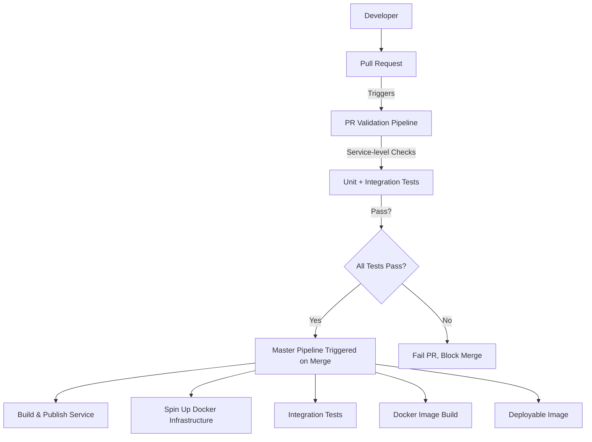

# CI/CD Pipelines

## Table of Contents

* [1. Overview](#1-overview)
* [2. PR Validation Pipeline](#2-pr-validation-pipeline)
* [3. Master Branch Pipelines](#3-master-branch-pipelines)
  * [3.1 ServiceName Master Pipeline](#31-servicename-master-pipeline)
  * [3.2 SampleAuthService Master Pipeline](#32-sampleauthservice-master-pipeline)
* [4. Pipeline Steps and Rationale](#4-pipeline-steps-and-rationale)
* [5. Build and Test Strategy](#5-build-and-test-strategy)
* [6. Docker Integration and Infrastructure Independence](#6-docker-integration-and-infrastructure-independence)
* [7. Development vs Production Pipelines](#7-development-vs-production-pipelines)
* [8. Workflow Diagram](#8-workflow-diagram)
* [9. Best Practices and Considerations](#9-best-practices-and-considerations)

---

## 1. Overview

The CI/CD pipelines ensure **code correctness, automated testing, and reproducible builds** before deployment. The system is designed to:

* Enforce **quality gates** at pull request (PR) stage  
* Validate both **unit and integration tests** for each service  
* Build **Docker images consistently** without relying on any specific production infrastructure  
* Remain **service-agnostic** in templates while allowing infra customization in real deployments  

Two types of pipelines exist:

1. **PR Validation** – checks pull requests for correctness  
2. **Master Branch Pipelines** – full build, test, publish, and Docker image creation  

> Only PRs passing validation can merge into master, ensuring a stable baseline.

---

## 2. PR Validation Pipeline

**Purpose**: Early detection of broken code and validation of individual services.  

**Design choices**:

* Triggered on PRs targeting `master`  
* Uses **conditional service detection**: only runs builds/tests for services that changed (`ServiceName` or `SampleAuthService`)  
* Ensures developers get **fast feedback** without wasting resources  
* Verifies **.NET SDK and environment compatibility**  

**Why this matters**:

* Prevents **invalid code** from entering master  
* Reduces CI/CD runtime for large repositories with multiple services  
* Provides **developer confidence** before merging  

**What can change for production**:

* Can run **all service builds** regardless of changes if strict full-regression validation is desired  
* Can include **static analysis, code style checks, and security scans**  

---

## 3. Master Branch Pipelines

Master pipelines handle **full build, integration tests, and Docker image publishing**.

### 3.1 ServiceName Master Pipeline

* Triggered on `master` push with changes in `ServiceName/**`  
* Steps:

  1. Checkout repository – ensures latest code  
  2. Setup .NET SDK – consistent build environment  
  3. Start infrastructure via Docker Compose (DB, Redis, RabbitMQ) – required for **integration tests**  
  4. Wait for readiness – ensures services are available  
  5. Restore & build solution – compiles project and dependencies  
  6. Run unit & integration tests – validate correctness  
  7. Publish API – prepares artifacts for deployment  
  8. Build Docker image – produces containerized version  

**Rationale**:

* Integration tests require infrastructure; using **Docker Compose** makes the pipeline **self-contained**  
* Avoids dependency on any production infra, so template is **portable**  
* Docker image creation in pipeline ensures **reproducibility**  

**What can change for production**:

* Use **real service endpoints or mocks** depending on staging/production environment  
* Implement **distributed caching or message bus** for integration tests if multiple nodes are needed  
* Add **security scanning, vulnerability checks, or image signing**  

---

### 3.2 SampleAuthService Master Pipeline

* Similar design to ServiceName pipeline but isolated to SampleAuthService  
* Infrastructure: separate DB, Redis, RabbitMQ  
* Steps ensure **independent validation** of auth service without affecting other services  

**Why separate pipelines**:

* Auth service may have **different dependencies and configuration**  
* Ensures **service-level isolation**  
* Avoids **cross-service interference** during testing  

---

## 4. Pipeline Steps and Rationale

| Step | Reason | Template vs Production Notes |
|------|--------|-----------------------------|
| Checkout | Pull latest code | Template uses generic `actions/checkout`; production may pin commit SHA for reproducibility |
| Setup .NET SDK | Ensures correct environment | Template uses latest .NET 8.x; production can pin exact version |
| Start Infrastructure | Required for integration tests | Template uses Docker Compose for portability; prod may use managed services (Azure SQL, AWS RDS) |
| Wait for readiness | Avoid race conditions | Can use smarter health check scripts in production |
| Restore & Build | Dependency resolution and compile | Template builds all projects; production may enable incremental builds |
| Unit Tests | Fast validation | Template only runs unit tests per changed service; production can run full suite |
| Integration Tests | Validate service with infra | Template uses ephemeral Docker services; production may mock sensitive systems |
| Publish API | Prepare artifacts | Template publishes to local path; production may push to artifact repo |
| Docker Build | Create container | Template builds generic image; production may tag with version, commit SHA, and push to registry |

---

## 5. Build and Test Strategy

* **Unit Tests**: validate code logic in isolation  
* **Integration Tests**: verify service behavior with database, cache, message broker  
* Conditional execution in PR pipeline saves **CI/CD runtime**  
* Fail-fast approach ensures **broken code is caught early**  

> In production, consider adding **end-to-end tests** before deployment to staging.

---

## 6. Docker Integration and Infrastructure Independence

**Design choice**: all pipelines use **Docker Compose** to spin up required services (SQL Server, Redis, RabbitMQ).  

**Benefits**:

* Makes pipelines **independent of real production infrastructure**  
* Template remains **portable**, reproducible across dev machines and CI/CD runners  
* Integration tests run in **isolated environment**  

**Production considerations**:

* Can replace Docker Compose with **cloud-managed services** (Azure SQL, AWS RDS, ElasticCache, etc.)  
* Ensure secrets are **not stored in `.env`**; use secret managers in production  
* Image tags and artifact storage should follow **versioning and registry conventions**

---

## 7. Development vs Production Pipelines

| Aspect | Development / Template | Production / Real Deployment |
|--------|----------------------|------------------------------|
| PR validation | Only builds/tests changed services | May include full regression tests |
| Infrastructure | Ephemeral Docker Compose | Managed cloud services or staging environments |
| Secrets | `.env` file | Secret managers / environment-specific variables |
| Docker images | Local ephemeral images | Tagged images pushed to registry |
| Test scope | Unit + basic integration | Full integration + end-to-end + performance tests |

---

## 8. Workflow Diagram

**Explanation**:

* PR triggers validation pipeline **before merge**  
* Only **validated code reaches master**  
* Master pipeline **builds, tests, and produces Docker images**  
* Infrastructure is **ephemeral in pipeline**, avoiding production dependencies  

---

## 9. Best Practices and Considerations

* **Fail early in PR** to avoid merging broken code  
* **Isolate services** – separate pipelines for independent services  
* **Keep templates infra-independent** – avoid hardcoding cloud services  
* **Use Docker Compose for ephemeral infrastructure**  
* **Monitor health checks** to avoid false negatives in tests  
* **Secrets management** – `.env` only for development  
* **Versioning & tagging** – ensure reproducible Docker images in production  

> This design ensures **portable, reproducible pipelines**, while production deployments can be adapted with **real infra, secret management, and advanced testing strategies**.