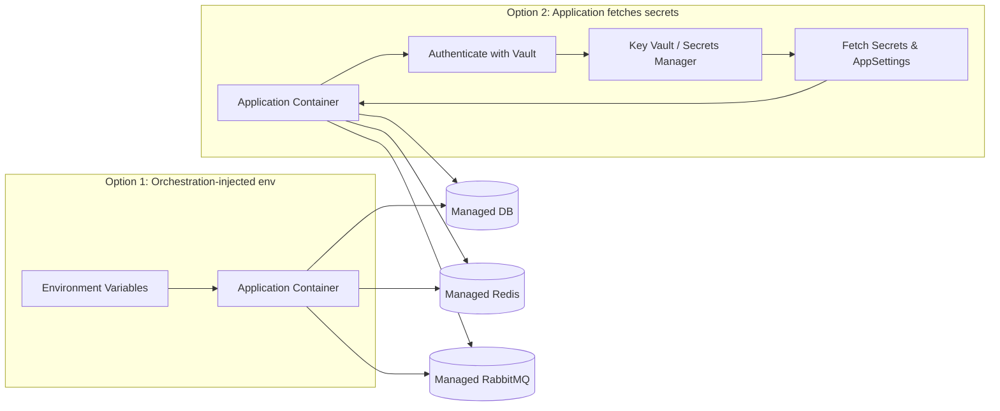
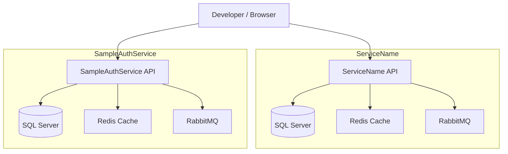
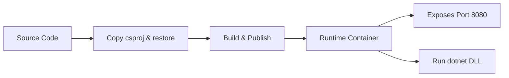

# Docker and Containerization

## Table of Contents

* [1. Overview](#1-overview)
* [2. Directory Structure and Deployment Folder](#2-directory-structure-and-deployment-folder)
* [3. .dockerignore](#3-dockerignore)
* [4. Environment Configuration (.env)](#4-environment-configuration-env)
* [5. Dockerfile Explanation](#5-dockerfile-explanation)
* [6. docker-compose Setup](#6-docker-compose-setup)
* [7. Service Dependencies and Health Checks](#7-service-dependencies-and-health-checks)
* [8. Development vs Production Considerations](#8-development-vs-production-considerations)
* [9. Logging and Persistence](#9-logging-and-persistence)
* [10. Potential Improvements](#10-potential-improvements)
* [11. Diagrams](#11-diagrams)

---

## 1. Overview

Docker is used to **containerize the services** for consistent development, testing, and deployment. Both `ServiceName` and `SampleAuthService` follow a **multi-stage Docker build pattern**:

* **Build stage** – restores dependencies, builds, and publishes the application  
* **Runtime stage** – runs a lightweight ASP.NET runtime container  

Benefits of Docker:

* **Environment consistency** – developers, CI/CD pipelines, and production run identical containers  
* **Isolation of dependencies** – no need for local installation of .NET SDK, SQL Server, Redis, or RabbitMQ  
* **Portability** – container images run on any platform with Docker support  
* **Orchestration readiness** – easy to integrate with Kubernetes, Docker Swarm, or cloud services  

---

## 2. Directory Structure and Deployment Folder

Each service contains a `deployment` folder:

```
ServiceName/
├─ deployment/
│  ├─ Dockerfile
│  ├─ docker-compose.yml
│  └─ .env
└─ src/...
```

```
SampleAuthService/
├─ deployment/
│  ├─ Dockerfile
│  ├─ docker-compose.yml
│  └─ .env
└─ src/...
```

* Deployment artifacts are **separated from source code**  
* Facilitates **CI/CD pipeline automation**  

---

## 3. .dockerignore

`.dockerignore` excludes unnecessary files to:

* Reduce image size  
* Speed up builds  
* Avoid copying sensitive or irrelevant files  

Typical exclusions:

* Build output (`bin/`, `obj/`)  
* IDE files (`.vs/`, `.user`, `.suo`)  
* OS files (`.DS_Store`, `Thumbs.db`)  
* Docker artifacts (`Dockerfile`, `docker-compose.yml`)  
* Logs (`*.log`)  

---

## 4. Environment Configuration (.env)

Each service has a `.env` file:

* `ASPNETCORE_ENVIRONMENT` – Development/Production  
* `ConnectionStrings__Default` – database connection string  
* JWT settings – `Key`, `Issuer`, `Audience`, `ExpireMinutes`  
* RabbitMQ and Redis host/port configuration  

> This allows **docker-compose** to inject variables consistently, separating **code from environment configuration**.  

---

## 5. Dockerfile Explanation

Dockerfiles follow a **multi-stage pattern**:

### Build Stage

* Base image: `mcr.microsoft.com/dotnet/sdk:8.0`  
* Copies only project files initially to leverage Docker caching  
* Restores dependencies (`dotnet restore`)  
* Publishes output to `/app/publish`  

### Runtime Stage

* Base image: `mcr.microsoft.com/dotnet/aspnet:8.0` (smaller footprint)  
* Sets environment variable `ASPNETCORE_URLS=http://+:8080`  
* Copies published output from build stage  
* Exposes port 8080  
* Entrypoint runs service DLL  

**Why multi-stage build?**

* Reduces final image size by excluding SDK and intermediate artifacts  
* Speeds up rebuilds with caching  
* Ensures reproducible builds  

---

## 6. docker-compose Setup

`docker-compose.yml` orchestrates **API + dependencies**:

* **API container** (`ServiceName` or `SampleAuthService`)  
* **Database** (SQL Server)  
* **Message broker** (RabbitMQ)  
* **Cache** (Redis)  

Example features:

* `depends_on` – ensures correct startup order  
* Health checks – ensures readiness before API starts  
* Volumes – persist database and log data  

```yaml
services:
  api:
    build:
      context: ..
      dockerfile: deployment/Dockerfile
    image: service-name
    ports:
      - "5000:8080"
    env_file:
      - .env
    depends_on:
      - db
      - rabbitmq
    volumes:
      - ./logs:/app/logs
```

---

## 7. Service Dependencies and Health Checks

* Each API depends on **its own database, Redis, and RabbitMQ**  
* Health checks monitor service readiness  

> Health checks are **critical for development orchestration** and can also feed **orchestration platforms** in production  

Typical health check targets:

* SQL Server port (`1433`)  
* RabbitMQ ping  
* Redis ping  
* API HTTP port (`8080`)  

---

## 8. Development vs Production Considerations

**Development**:

* Full `docker-compose` stack runs locally  
* Mounted logs for easy access  
* Ports mapped to host for testing  
* Environment: `Development`  
* `.env` files provide all secrets and configuration (JWT keys, DB connection strings, etc.)  

**Production**:

* Local `.env` files are **not used in production**  
* Managed services may replace local containers:  
  * SQL Server → Azure SQL / AWS RDS / Cloud SQL  
  * RabbitMQ → Managed service or cloud-native queue  
  * Redis → Managed cache  
* Secrets and sensitive configuration are injected **securely at runtime**, commonly using orchestration or cloud secret management:  

### How Configuration Can Be Provided in Production



1. **Orchestration-injected environment variables**  

   * Kubernetes, Docker Swarm, or Azure App Service can inject environment variables at runtime  
   * Containers remain generic and **infrastructure-agnostic**  

2. **Application-level secret fetching**  

   * The code itself can authenticate with a **vault or secret store** (e.g., Azure Key Vault, AWS Secrets Manager, HashiCorp Vault)  
   * Fetch `appsettings` or connection strings dynamically  
   * Example flow in Azure:  

```text
App starts -> Authenticate to Azure Managed Identity -> Access Key Vault -> Fetch secrets -> Configure appsettings/environment variables
```

* Advantages:  
  * Removes the need to bake secrets into containers  
  * Supports **rotating secrets** without redeploying containers  
  * Keeps containers **portable and environment-agnostic**  

> Note: The exact implementation depends on the cloud provider and company-specific secret management strategy. Dockerfiles remain the same; only runtime configuration changes.


## 9. Logging and Persistence

* Logs are persisted via **volume mounts** (`./logs:/app/logs`)  
* Database volumes ensure **data persistence across container restarts**  
* In production, persistent storage may be managed by **cloud services** (Azure SQL, AWS RDS, Redis, etc.)  

---

## 10. Potential Improvements

1. **Secrets management** – avoid `.env` in repos, use secrets manager  
2. **Distributed deployments** – handle multi-instance scaling with shared Redis, messaging queues  
3. **Dynamic health checks** – integrate monitoring, auto-restart unhealthy containers  
4. **Production-specific compose files** – for managed DBs and message brokers  
5. **Optimize image size** – cache NuGet packages, remove unnecessary files  

---

## 11. Diagrams

### 11.1 Service Interaction Diagram



**Explanation**:

* Each API has **isolated infrastructure** for dev/testing  
* Developers interact with APIs via exposed ports  
* Dependencies (DB, Redis, RabbitMQ) are orchestrated for **service readiness**  

### 11.2 Docker Build and Runtime Flow



**Explanation**:

* Build stage generates **publish output**  
* Runtime stage uses lightweight image  
* EntryPoint executes the application  