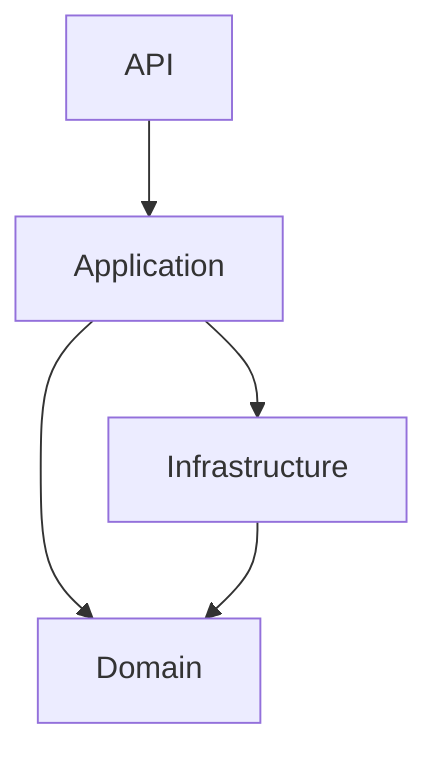

# Creating a New Service

This document explains how to create a new microservice using the structure and patterns provided by this template.

The goal is to ensure that all services in the system follow a **consistent architecture**, making them easier to maintain, test, and extend as the system grows.

The process described here focuses on **structural consistency rather than automation** so that developers clearly understand how the template is organized.

---

# Table of Contents

* [1. Overview](#1-overview)
* [2. Service Creation Workflow](#2-service-creation-workflow)
* [3. Step 1 — Create the Service Directory](#3-step-1--create-the-service-directory)
* [4. Step 2 — Create the Core Projects](#4-step-2--create-the-core-projects)
* [5. Step 3 — Add the Projects to the Solution](#5-step-3--add-the-projects-to-the-solution)
* [6. Step 4 — Configure Dependencies Between Layers](#6-step-4--configure-dependencies-between-layers)
* [7. Step 5 — Copy Shared Infrastructure Patterns](#7-step-5--copy-shared-infrastructure-patterns)
* [8. Step 6 — Configure Authentication](#8-step-6--configure-authentication)
* [9. Step 7 — Register Services in Dependency Injection](#9-step-7--register-services-in-dependency-injection)
* [10. Step 8 — Add Tests](#10-step-8--add-tests)
* [11. Step 9 — Add Deployment Configuration](#11-step-9--add-deployment-configuration)
* [12. Final Structure](#12-final-structure)

---

# 1. Overview

Every service created from this template follows the same **four-layer structure**:

```
API Layer
Application Layer
Domain Layer
Infrastructure Layer
```

Each layer has a distinct responsibility:

| Layer          | Responsibility                                 |
| -------------- | ---------------------------------------------- |
| API            | HTTP endpoints and middleware                  |
| Application    | Business workflows and use cases               |
| Domain         | Core business models                           |
| Infrastructure | External integrations (DB, messaging, caching) |

The goal is to ensure that:

* business logic is isolated
* infrastructure technologies can change without affecting core logic
* services remain easy to test and maintain

---

# 2. Service Creation Workflow

Creating a new service typically follows this sequence:

```
Create service directory
        ↓
Create layer projects
        ↓
Add references between layers
        ↓
Configure infrastructure
        ↓
Add tests
        ↓
Add deployment configuration
```

This ensures that every service begins with the same architectural foundation.

---

# 3. Step 1 — Create the Service Directory

Inside the repository root, create a directory for the new service.

Example:

```
InventoryService
```

Inside it, create the standard project layout:

```
InventoryService
 ├─ src
 ├─ tests
 └─ deployment
```

This keeps **source code, tests, and operational configuration clearly separated**.

---

# 4. Step 2 — Create the Core Projects

Each service contains **four main projects**, corresponding to the architecture layers.

Create them inside the `src` directory.

```
InventoryService/src
 ├─ InventoryService.Api
 ├─ InventoryService.Application
 ├─ InventoryService.Domain
 └─ InventoryService.Infrastructure
```

Example commands:

```bash
dotnet new webapi -n InventoryService.Api
dotnet new classlib -n InventoryService.Application
dotnet new classlib -n InventoryService.Domain
dotnet new classlib -n InventoryService.Infrastructure
```

---

# 5. Step 3 — Add the Projects to the Solution

Once created, the projects must be added to the repository solution file.

Example:

```bash
dotnet sln add src/InventoryService.Api
dotnet sln add src/InventoryService.Application
dotnet sln add src/InventoryService.Domain
dotnet sln add src/InventoryService.Infrastructure
```

This allows the solution to build and manage the projects together.

---

# 6. Step 4 — Configure Dependencies Between Layers

The template enforces **directional dependencies** between layers.

The dependency graph should look like this:



Add references accordingly.

Example:

```bash
dotnet add InventoryService.Api reference InventoryService.Application
dotnet add InventoryService.Application reference InventoryService.Domain
dotnet add InventoryService.Application reference InventoryService.Infrastructure
dotnet add InventoryService.Infrastructure reference InventoryService.Domain
```

This prevents infrastructure concerns from leaking into business logic.

---

# 7. Step 5 — Copy Shared Infrastructure Patterns

Most services will require the same foundational infrastructure components.

These can be copied or adapted from the example services in the repository.

Common components include:

| Component             | Purpose                 |
| --------------------- | ----------------------- |
| DbContext             | Database access         |
| Repository pattern    | Persistence abstraction |
| EventBus              | Messaging abstraction   |
| CacheService          | Redis caching           |
| Logging configuration | Structured logging      |

These components are located in the **Infrastructure layer** of existing services.

---

# 8. Step 6 — Configure Authentication

Services do not manage identity themselves.
Authentication is delegated to the **SampleAuthService**.

Each service must configure JWT validation.

Example configuration in `appsettings.json`:

```json
"Jwt": {
  "Key": "MyVeryStrongDevelopmentKey_ChangeInProduction_123456",
  "Issuer": "SampleAuthService",
  "Audience": "SampleServices",
  "ExpireMinutes": 60
}
```

The API project must also register authentication middleware:

```
services.AddAuthentication()
services.AddAuthorization()
```

Authorization policies should match those defined in the template.

---

# 9. Step 7 — Register Services in Dependency Injection

Each service must register its dependencies in the DI container.

Typical registrations include:

```
Application services
Repositories
Caching services
Messaging services
```

Example:

```csharp
services.AddScoped<IProductService, ProductService>();
services.AddScoped<IRepository<Product>, ProductRepository>();
```

Dependency Injection ensures that components remain loosely coupled.

---

# 10. Step 8 — Add Tests

Each service should include two test projects.

```
tests
 ├─ InventoryService.UnitTests
 └─ InventoryService.IntegrationTests
```

Create them with:

```bash
dotnet new xunit -n InventoryService.UnitTests
dotnet new xunit -n InventoryService.IntegrationTests
```

Testing structure should follow the same pattern used in the template.

Unit tests validate individual components, while integration tests verify full application behavior.

---

# 11. Step 9 — Add Deployment Configuration

Deployment artifacts belong in the `deployment` directory.

Typical files include:

```
docker-compose.yml
Dockerfile
environment configuration
```

Separating deployment configuration from application code allows the service to be deployed in multiple environments.

---

# 12. Final Structure

After completing the setup, the new service should resemble the following structure:

```text
InventoryService
└─src/
  ├─ InventoryService.Api
  │ ├─ Controllers
  │ ├─ Middlewares
  │ └─ Extensions
  │   ├─ Application
  │   ├─ Builder
  │   └─ Services
  ├─ InventoryService.Application
  │ ├─ DTOs
  │ ├─ Interfaces
  │ └─ Services
  ├─ InventoryService.Domain
  │ ├─ Entities
  │ └─ Enums
  ├─ InventoryService.Infrastructure
  │ ├─ Persistence
  │ ├─ Repositories
  │ ├─ Messaging
  │ ├─ Caching
  │ └─ Migrations
tests/
  ├─ InventoryService.UnitTests
  └─ InventoryService.IntegrationTests
deployment/
```

This structure ensures that all services in the system remain **consistent and predictable**.

