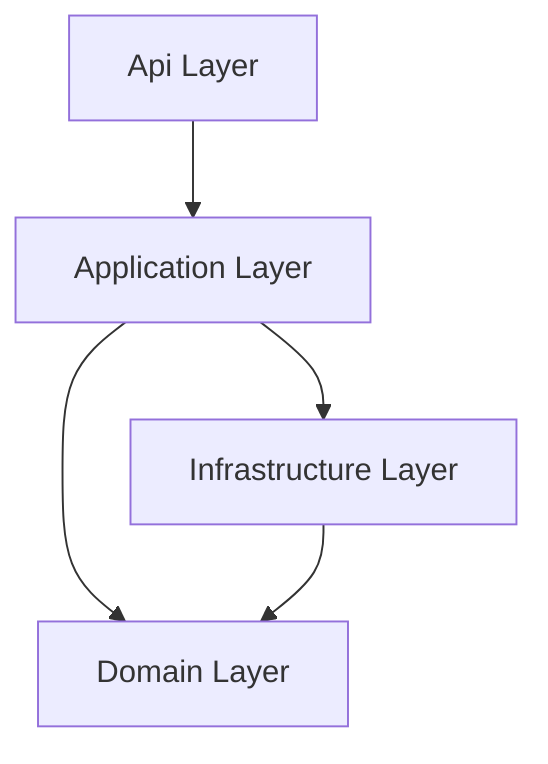
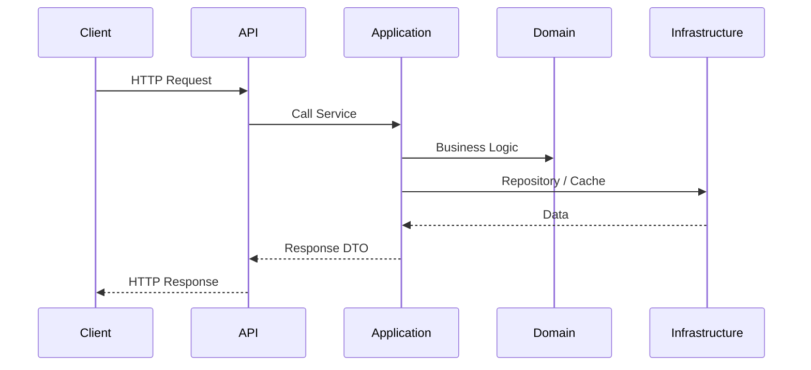
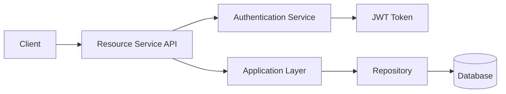

# Project Structure

This repository provides a **microservice template** designed to keep services consistent and easy to understand.
Two example services are included:

* **Resource Service** – represents a typical business microservice
* **Authentication Service** – provides authentication capabilities used by other services

Both services follow the same architecture and folder organization so teams can **reuse patterns across services**.

---

# Service Structure

## Resource Service

```text
ServiceName
└─src/
  ├─ ServiceName.Api
  │ ├─ Controllers
  │ ├─ Middlewares
  │ └─ Extensions
  │   ├─ Application
  │   ├─ Builder
  │   └─ Services
  ├─ ServiceName.Application
  │ ├─ DTOs
  │ ├─ Events
  │ ├─ Interfaces
  │ └─ Services
  ├─ ServiceName.Domain
  │ ├─ Enums
  │ └─ Entities
  ├─ ServiceName.Infrastructure
  │ ├─ Persistence
  │ ├─ Repositories
  │ ├─ BackgroundServices
  │ ├─ Configuration
  │ ├─ Messaging
  │ ├─ Caching
  │ └─ Migrations
tests/
  ├─ ServiceName.UnitTests
  │ ├─ Controllers
  │ ├─ Repository
  │ └─ Services
  ├─ ServiceName.IntegrationTests
  │ ├─ Api
  │ ├─ Fixtures
  │ └─ Helpers
deployment/
```

---

## Authentication Service

The authentication service follows the same structure but introduces an additional **Security** component.

```text
SampleAuthService
└─src/
  ├─ SampleAuthService.Api
  │ ├─ Controllers
  │ ├─ Middlewares
  │ └─ Extensions
  │   ├─ Application
  │   ├─ Builder
  │   └─ Services
  ├─ SampleAuthService.Application
  │ ├─ DTOs
  │ ├─ Interfaces
  │ └─ Services
  ├─ SampleAuthService.Domain
  │ ├─ Enums
  │ └─ Entities
  ├─ SampleAuthService.Infrastructure
  │ ├─ Persistence
  │ ├─ Repositories
  │ ├─ Security
  │ ├─ BackgroundServices
  │ ├─ Configuration
  │ ├─ Messaging
  │ ├─ Caching
  │ └─ Migrations
tests/
deployment/
```

---

# Architecture Overview

The template follows a **layered architecture influenced by Clean Architecture principles**.

Each layer has a clearly defined responsibility:

| Layer          | Responsibility                 |
| -------------- | ------------------------------ |
| Api            | Transport and HTTP interaction |
| Application    | Use-case orchestration         |
| Domain         | Business models and rules      |
| Infrastructure | Technical integrations         |



Dependencies flow **toward the Domain layer**, ensuring that business logic remains independent of infrastructure technologies.

---

# Request Flow

The following diagram illustrates how a typical request moves through the service.



This flow ensures that:

* controllers remain thin
* business logic resides in the application and domain layers
* infrastructure handles technical concerns

---

# Folder Responsibilities

Instead of describing individual files, folders define **the types of components that belong there**.

---

# Api Layer

The **Api layer exposes the service through HTTP** and contains framework-specific components.

### Controllers

Contains components responsible for handling **incoming HTTP requests**.

Typical contents include:

* request handlers
* request validation logic
* mapping requests to application services

Controllers should remain thin and delegate business logic to the application layer.

---

### Middlewares

Contains components responsible for **cross-cutting concerns in the HTTP pipeline**.

Typical responsibilities include:

* exception handling
* request logging
* correlation ID propagation
* authentication context handling

Grouping middleware separately keeps pipeline logic isolated from endpoint logic.

---

### Extensions

The Extensions folder contains **service configuration helpers used during application startup**.

It is divided into smaller areas to keep configuration modular.

#### Application

Contains extension methods responsible for **registering application-layer services**.

Typical contents include dependency registration for:

* application services
* validators
* DTO mappings

---

#### Builder

Contains extension methods responsible for **configuring the application builder and middleware pipeline**.

Typical responsibilities include:

* middleware pipeline configuration
* routing setup
* API behavior configuration

---

#### Services

Contains extension methods responsible for **registering external or supporting services**.

Examples include:

* HTTP clients
* third-party integrations
* shared adapters

---

# Application Layer

The **Application layer defines service behavior** and orchestrates use cases.

---

### DTOs

Contains **Data Transfer Objects** used to move structured data between layers.

Typical contents include:

* request models
* response models
* service communication objects

DTOs represent **application-level contracts**, not domain entities.

---

### Events

Contains definitions for **events published or consumed by the service**.

Typical contents include:

* integration event contracts
* messaging payload definitions
* event metadata structures

These represent the service's **communication model with other services**.

---

### Interfaces

Contains **abstractions used by the application layer**.

Typical interfaces include:

* repository contracts
* caching abstractions
* messaging abstractions
* service interfaces

These abstractions allow the application layer to depend on **contracts instead of implementations**.

---

### Services

Contains **application service implementations**.

Typical responsibilities include:

* coordinating domain logic
* interacting with repositories
* publishing events
* executing service workflows

These services implement the **use cases of the microservice**.

---

# Domain Layer

The **Domain layer contains the core business model**.

This layer should remain independent of frameworks and infrastructure.

---

### Entities

Contains domain entities representing **core business concepts**.

Typical contents include:

* aggregate roots
* domain state
* business behavior

Entities represent **business rules rather than persistence structures**.

---

### Enums

Contains enumerations used by domain entities and business logic.

Examples might include:

* resource states
* lifecycle statuses
* workflow stages

These are placed in the domain layer because they represent **business concepts**.

---

# Infrastructure Layer

The **Infrastructure layer contains concrete technical implementations**.

These components interact with external systems such as databases, caches, and messaging platforms.

---

### Persistence

Contains components responsible for **database access configuration**.

Typical contents include:

* ORM database contexts
* entity mappings
* persistence configuration

---

### Repositories

Contains implementations of repository interfaces defined in the application layer.

Typical responsibilities include:

* database queries
* entity persistence
* translating domain objects to storage models

---

### BackgroundServices

Contains long-running services responsible for **asynchronous processing**.

Typical use cases include:

* message consumers
* scheduled jobs
* background workers

---

### Configuration

Contains classes responsible for **binding configuration from external sources**.

Typical contents include:

* options classes
* configuration mapping objects
* environment configuration models

---

### Messaging

Contains implementations responsible for **communication with message brokers**.

Typical components include:

* event publishers
* message consumers
* broker adapters

Examples of supported technologies may include:

* RabbitMQ
* Kafka
* Azure Service Bus

---

### Caching

Contains caching implementations used by the service.

Typical examples include:

* Redis caching adapters
* in-memory caching implementations
* cache helpers

Keeping caching here ensures it remains a **replaceable infrastructure concern**.

---

### Migrations

Contains database migration artifacts used to track **schema evolution over time**.

These files are tightly coupled to persistence technologies and therefore belong in infrastructure.

---

### Security (Authentication Service Only)

The authentication service introduces a **Security module**.

This folder contains components responsible for **authentication and credential management**.

Typical responsibilities include:

* password hashing
* token generation
* authentication providers
* security utilities

These components rely on cryptographic libraries and therefore belong in infrastructure.

---

# Tests

Tests are placed outside the main source tree to maintain a clear boundary between production and test code.

---

### Unit Tests

Unit tests focus on **isolated components**.

Tests are organized by component type:

* Controllers
* Repositories
* Services

External dependencies are typically mocked.

---

### Integration Tests

Integration tests verify **end-to-end behavior across multiple components**.

Subfolders include:

| Folder   | Purpose                       |
| -------- | ----------------------------- |
| Api      | Tests for API endpoints       |
| Fixtures | Shared test environment setup |
| Helpers  | Utility classes used by tests |

These tests validate service behavior with real infrastructure components.

---

# Service Interaction

The following diagram illustrates how the **Resource Service interacts with the Authentication Service**.



This model keeps authentication responsibilities **separate from domain services**, allowing authentication to evolve independently.

---

# Deployment

The `deployment/` directory contains infrastructure artifacts used to **deploy services in different environments**.

Typical contents may include:

* container definitions
* environment configuration
* orchestration scripts

Separating deployment configuration from application code helps maintain **clear boundaries between application logic and operational concerns**.

---

# Why the Template Is Intentionally Simple

Many microservice templates introduce unnecessary complexity early in development.

This template prioritizes:

* **clear architectural boundaries**
* **consistent structure across services**
* **minimal abstraction overhead**

The goal is to provide a **practical starting point** that teams can extend as services grow, without imposing rigid architectural constraints.
