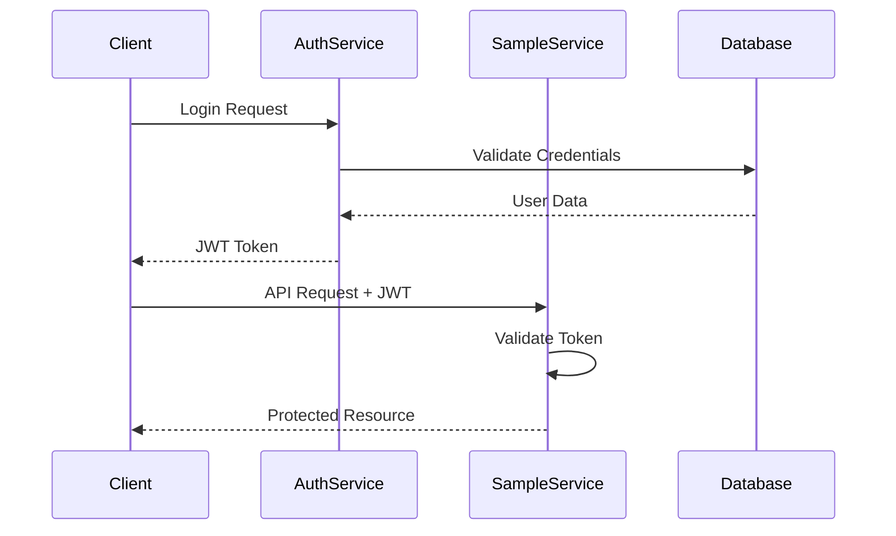

# Authentication & Authorization

This document explains how authentication and authorization are implemented in the microservice template. It describes how tokens are issued by the authentication service, how other services validate those tokens, and how role-based access control is enforced across the system.

The goal of this guide is to explain the architectural decisions behind the authentication system and demonstrate how the components interact during request processing.

---

# Table of Contents

* [1. Authentication Architecture Overview](#1-authentication-architecture-overview)
* [2. Authentication Service](#2-authentication-service)
* [3. Token Generation Flow](#3-token-generation-flow)
* [4. Password Security](#4-password-security)
* [5. JWT Token Structure](#5-jwt-token-structure)
* [6. Token Validation in Microservices](#6-token-validation-in-microservices)
* [7. Authorization Policies](#7-authorization-policies)
* [8. Applying Authorization in Controllers](#8-applying-authorization-in-controllers)
* [9. Role-Based Access Control](#9-role-based-access-control)
* [10. Service Trust Model](#10-service-trust-model)
* [11. Configuration and Security Settings](#11-configuration-and-security-settings)
* [12. Design Decisions](#12-design-decisions)
* [13. Extending or Replacing the Authentication System](#13-extending-or-replacing-the-authentication-system)

---

# 1. Authentication Architecture Overview

Authentication in this template is implemented using a **dedicated authentication service** that issues JSON Web Tokens (JWT). Other microservices trust tokens issued by this service and validate them locally.

This design keeps authentication centralized while allowing authorization decisions to remain distributed across services.



In this architecture:

* **SampleAuthService** acts as the identity provider.
* **Other microservices** act as resource servers.
* Each service validates tokens independently without calling the auth service for every request.

This approach ensures that authentication remains **stateless and scalable**.

---

# 2. Authentication Service

The authentication service is responsible for managing users and issuing tokens.

Its responsibilities include:

* registering users
* verifying credentials
* issuing JWT tokens
* managing password changes
* publishing user-related events

Example controller responsible for token generation:

```csharp
[ApiController]
[Route("api/v1/token")]
public class TokenController : ControllerBase
{
    private readonly ITokenService _authToken;

    public TokenController(ITokenService authToken)
    {
        _authToken = authToken;
    }

    [AllowAnonymous]
    [HttpPost]
    public async Task<IActionResult> GenerateTokenAsync(TokenRequestDto dto)
    {
        var token = await _authToken.GenerateTokenAsync(dto);

        if (token == null)
            return Unauthorized();

        return Ok(token);
    }
}
```

The controller itself does not perform authentication logic. Instead, it delegates this responsibility to the **Application layer** through `ITokenService`.

---

# 3. Token Generation Flow

The process of generating a token occurs inside the `TokenService`.

Example service implementation:

```csharp
public class TokenService : ITokenService
{
    private readonly IUserRepository _users;
    private readonly IJwtService _jwt;

    public TokenService(
        IUserRepository users,
        IJwtService jwt)
    {
        _users = users;
        _jwt = jwt;
    }

    public async Task<TokenResponseDto?> GenerateTokenAsync(TokenRequestDto dto)
    {
        var user = await _users.GetUserByEmailAsync(dto.Email);

        if (user == null)
            throw new KeyNotFoundException("User not found.");

        if (!BCrypt.Net.BCrypt.Verify(dto.Password, user.PasswordHash))
            throw new ArgumentException("Invalid credentials.");

        var token = _jwt.GenerateToken(user);

        return new TokenResponseDto
        {
            AccessToken = token
        };
    }
}
```

The steps performed during token generation are:

```
Client Login Request
   ↓
Controller
   ↓
TokenService
   ↓
UserRepository
   ↓
Password Verification
   ↓
JWT Generation
   ↓
Token Response
```

Each component has a clearly defined responsibility.

---

# 4. Password Security

Passwords are never stored in plain text. Instead, they are hashed using **BCrypt** before being stored in the database.

Example hashing:

```csharp
var hash = BCrypt.Net.BCrypt.HashPassword(dto.Password);
```

Example verification:

```csharp
BCrypt.Net.BCrypt.Verify(dto.Password, user.PasswordHash)
```

BCrypt was chosen because it provides:

* adaptive hashing
* built-in salting
* resistance against brute-force attacks

Adaptive hashing means the computational cost of hashing can be increased over time as hardware becomes more powerful.

---

# 5. JWT Token Structure

The system uses **JSON Web Tokens** to represent authenticated user identity.

Example token claims:

```csharp
var claims = new[]
{
    new Claim(JwtRegisteredClaimNames.Sub, user.Id.ToString()),
    new Claim(JwtRegisteredClaimNames.Email, user.Email),
    new Claim(ClaimTypes.Role, user.Role.ToString())
};
```

Typical token payload:

```
sub   -> user identifier
email -> user email
role  -> user role
```

The token is signed using a symmetric key:

```csharp
var key = new SymmetricSecurityKey(
    Encoding.UTF8.GetBytes(_opt.Key));
```

Token expiration is configured in the application settings:

```
Jwt:ExpireMinutes
```

This prevents tokens from remaining valid indefinitely.

---

# 6. Token Validation in Microservices

Each microservice validates incoming tokens using **JWT Bearer Authentication**.

Example configuration:

```csharp
services.AddAuthentication(JwtBearerDefaults.AuthenticationScheme)
    .AddJwtBearer(options =>
    {
        options.TokenValidationParameters =
            new TokenValidationParameters
            {
                ValidateIssuer = true,
                ValidateAudience = true,
                ValidateLifetime = true,
                ValidateIssuerSigningKey = true,

                ValidIssuer = jwtSection["Issuer"],
                ValidAudience = jwtSection["Audience"],

                IssuerSigningKey =
                    new SymmetricSecurityKey(
                        Encoding.UTF8.GetBytes(jwtSection["Key"]))
            };
    });
```

Token validation ensures:

* the token was issued by a trusted authority
* the token has not expired
* the token signature is valid
* the token audience matches the service

Because tokens are self-contained, services can validate them **without contacting the authentication service**.

---

# 7. Authorization Policies

Authorization is implemented using **ASP.NET Authorization Policies**.

Policies define rules that determine whether a user can access a particular resource.

Example configuration:

```csharp
services.AddAuthorization(options =>
{
    options.AddPolicy("ReadPolicy",
        policy => policy.RequireRole(
            "ReadUser",
            "WriteUser",
            "Admin"));

    options.AddPolicy("WritePolicy",
        policy => policy.RequireRole(
            "WriteUser",
            "Admin"));

    options.AddPolicy("AdminPolicy",
        policy => policy.RequireRole(
            "Admin"));
});
```

Policies provide a centralized way to define authorization rules.

---

# 8. Applying Authorization in Controllers

Controllers enforce authorization using attributes.

Example:

```csharp
[Authorize]
[ApiController]
[Route("api/v1/samples")]
public class SampleController : ControllerBase
```

Endpoint-level policies:

```csharp
[Authorize(Policy = "ReadPolicy")]
[HttpGet]
public async Task<IActionResult> GetAllAsync()
```

This ensures that:

* authentication is required
* only users with appropriate roles can access certain endpoints

---

# 9. Role-Based Access Control

The template uses a simple **Role-Based Access Control (RBAC)** model.

Available roles:

```
ReadUser
WriteUser
Admin
```

Access rules:

| Operation              | Allowed Roles              |
| ---------------------- | -------------------------- |
| Read operations        | ReadUser, WriteUser, Admin |
| Write operations       | WriteUser, Admin           |
| Administrative actions | Admin                      |

This simplified model demonstrates authorization concepts without introducing unnecessary complexity.

---

# 10. Service Trust Model

In this architecture, microservices trust tokens issued by the authentication service.

```
AuthService
   ↓ issues token
Client
   ↓ sends token
Other Microservices
   ↓ validate token locally
Protected Resources
```

Services do **not** call the authentication service for every request.

Instead, they rely on:

* token signatures
* issuer validation
* audience validation

This trust model allows services to remain **independent and horizontally scalable**.

---

# 11. Configuration and Security Settings

Authentication settings are defined in `appsettings.json`.

Example configuration:

```
"Jwt": {
  "Key": "MyVeryStrongDevelopmentKey",
  "Issuer": "SampleAuthService",
  "Audience": "SampleServices",
  "ExpireMinutes": 30
}
```

Important configuration values:

| Setting       | Purpose                             |
| ------------- | ----------------------------------- |
| Key           | Signing key used to generate tokens |
| Issuer        | Identifies the token issuer         |
| Audience      | Defines intended token recipients   |
| ExpireMinutes | Token expiration duration           |

These settings must remain consistent across services.

---

# 12. Design Decisions

This template intentionally favors **clarity and simplicity**.

### Dedicated Authentication Service

Separating authentication from other services improves:

* scalability
* maintainability
* security boundaries


### JWT-Based Authentication

JWT tokens were chosen because they enable:

* stateless authentication
* efficient service-to-service communication
* horizontal scaling


### Minimal Claims

The token includes only essential claims to keep tokens small and easy to process.


### Simplified Role Model

The role system is intentionally minimal to make the template easier to understand.

Real systems often implement more complex permission models.


# 13. Extending or Replacing the Authentication System

The template was designed to allow authentication mechanisms to be replaced with minimal changes.

Possible replacements include:

* OAuth2 / OpenID Connect
* Keycloak
* IdentityServer
* Auth0
* Azure AD
* AWS Cognito

Because services only depend on **JWT validation**, switching authentication providers usually requires minimal modifications.


