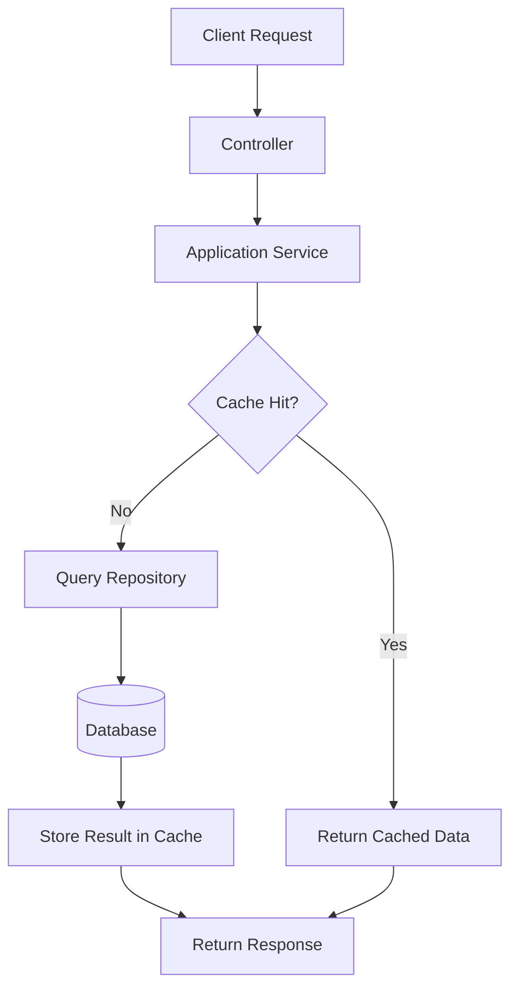

# Caching

## Table of Contents

- [1. Overview](#1-overview)
- [2. Architecture](#2-architecture)
- [3. Request Flow](#3-request-flow)
- [4. Failure Handling](#4-failure-handling)
- [5. Caching Strategy](#5-caching-strategy)
- [6. When to Use Caching](#6-when-to-use-caching)
## 1. Overview

This template supports **Redis-based caching** to reduce database load and improve response times for frequently requested data.

Caching is implemented using the **cache-aside pattern**. In this approach, the application service explicitly decides when data should be retrieved from the cache or from the database. The service first attempts to read data from the cache. If the value is not present, it retrieves the data from the repository and stores it in the cache for future requests.

**Redis** is used because it provides fast in-memory access and works well as a shared cache across multiple service instances.

The cache is treated as **optional infrastructure**. If **Redis** becomes unavailable, the application continues to function normally by retrieving data directly from the database. Cache failures therefore impact **performance only**, not system correctness.


## 2. Architecture

Caching is implemented in the [Infrastructure layer](../architecture/overview.md#infrastructure-layer), while decisions about when caching should occur remain in the [Application layer](../architecture/overview.md#application-layer).

Application services interact with the cache through a small abstraction (`ICacheService`). This prevents the rest of the system from depending directly on Redis and keeps the application layer independent of infrastructure concerns.

Controllers do not access the cache directly. Instead, controllers call application services, which may decide to use caching as part of their internal logic.

The cache stores temporary copies of frequently accessed data to reduce database load but still the database remains the **source of truth**.

```mermaid
flowchart LR

Client --> Controller
Controller --> Service

Service --> Cache
Service --> Repository

Repository --> Database
````

This structure keeps caching behavior **explicit and easy to reason about**. The infrastructure layer provides the cache implementation, but the application layer remains responsible for deciding when caching should occur.

### Cache Abstraction

Application services depend on a small interface rather than interacting with Redis directly.

```csharp
public interface ICacheService
{
    Task<T?> GetAsync<T>(string key);

    Task SetAsync<T>(
        string key,
        T value,
        TimeSpan ttl);

    Task RemoveAsync(string key);
}
```

This abstraction allows services to:

* retrieve cached values
* store new values in the cache
* invalidate cached entries when data changes

The Redis-specific implementation exists in the **Infrastructure layer**, while the rest of the application depends only on this interface.

### Infrastructure Registration

Redis is registered during application startup and exposed through the `ICacheService` abstraction, and its dependencies are provided by the [Dependency Injection](../architecture/request-flow.md#8-dependency-injection) container.

```csharp
services.AddSingleton<IConnectionMultiplexer>(sp =>
{
    var options = ConfigurationOptions.Parse(redisConnection);
    options.AbortOnConnectFail = false;

    return ConnectionMultiplexer.Connect(options);
});

services.AddScoped<ICacheService, RedisCacheService>();
```

`AbortOnConnectFail = false` allows the service to start even if Redis is not reachable during startup. The connection will be retried later, and cache operations will gracefully fall back to the database until Redis becomes available.

This design ensures that Redis outages do not prevent the service from starting.

## 3. Request Flow

The template uses the **cache-aside pattern** for read operations.

When a request is processed, the application service first attempts to retrieve the value from the cache. If the value is present, it is returned immediately. If it is not found, the service retrieves the data from the repository and stores the result in the cache.



This pattern provides two key benefits:

* frequently requested data can be returned quickly
* repeated database queries are avoided

Because caching logic remains in the application service, developers can clearly see when cached data is being used.

### Cache Miss Behavior

When a cache miss occurs, the application retrieves the data from the repository and stores the result in the cache.

The first request therefore incurs the full database cost, while subsequent requests can be served directly from Redis until the cache entry expires or is invalidated.

This behavior is typical for cache-aside systems and allows performance improvements without introducing strong coupling between the cache and the database.


### Example Usage in a Service

A typical read operation follows the cache-aside pattern.

```csharp
public async Task<GetSampleRequestDto?> GetByIdAsync(Guid id)
{
    var cacheKey = $"sample:id:{id}";

    var cached = await _cache.GetAsync<GetSampleRequestDto>(cacheKey);

    if (cached != null)
        return cached;

    var entity = await _repository.GetByIdAsync(id);
    if (entity == null)
        return null;

    var dto = new GetSampleRequestDto
    {
        Id = entity.Id,
        Name = entity.Name
    };

    await _cache.SetAsync(cacheKey, dto,
        TimeSpan.FromMinutes(10));

    return dto;
}
```

The service first attempts to retrieve the item from the cache. If the cache does not contain the value, the repository is queried and the result is stored in the cache.

This approach improves performance for endpoints that frequently request the same resource.


## 4. Failure Handling

Caching is treated strictly as a **performance optimization**. Cache failures must never break core application behavior.

If Redis becomes unavailable, cache operations behave as if the cache were empty. The application simply falls back to the database.

That's why the Redis implementation handles failures internally and logs them for observability, rather than relying on the global exception handler, which would return a 500 Internal Server Error.

Common failure scenarios include:

* Redis connection failures
* temporary network interruptions
* command timeouts

When these errors occur, the cache service returns `null` for reads or ignores write failures.

Example:

```csharp
public async Task<T?> GetAsync<T>(string key)
{
    try
    {
        var value = await _db.StringGetAsync(key);

        if (!value.HasValue)
            return default;

        return JsonSerializer.Deserialize<T>(value!);
    }
    catch (RedisConnectionException)
    {
        return default;
    }
    catch (TimeoutException)
    {
        return default;
    }
}
```

This ensures that:

* requests never fail due to cache issues
* the database remains the reliable fallback
* Redis outages affect performance but not correctness


## 5. Caching Strategy

Caching should be applied selectively to operations that benefit from faster access.

In this template, caching is typically used for **individual entity lookups**, such as retrieving a resource by its identifier. These operations are often requested repeatedly and benefit significantly from caching.

Large collections, such as `GetAll` operations, are intentionally not cached. Caching large lists can introduce memory pressure and create complex invalidation scenarios in distributed systems.

Instead, production systems typically rely on:

* pagination
* filtering
* caching individual resources


### Cache Invalidation

Cache entries must be invalidated when underlying data changes.

Write operations remove the corresponding cache entry so that the next read retrieves fresh data from the database.

Example:

```csharp
public async Task UpdateAsync(UpdateSampleRequestDto dto)
{
    await _repository.UpdateAsync(entity);

    var cacheKey = $"sample:id:{dto.Id}";

    await _cache.RemoveAsync(cacheKey);
}
```

This approach keeps the cache consistent with the database while avoiding complicated synchronization mechanisms.

Because the cache is only a temporary optimization layer, it is acceptable for cached entries to expire or be removed without affecting system correctness.

### Cache Expiration

Cached entries use a fixed TTL to prevent stale data from remaining indefinitely.
In this template, entities are cached for 10 minutes.

The TTL balances two concerns:

- reducing database load for frequently requested data
- ensuring stale data is eventually refreshed

Because write operations invalidate the cache explicitly, the TTL primarily acts as a safety mechanism rather than the main consistency strategy.

## 6. When to Use Caching

Caching should be applied to operations where repeated requests return the same data and the cost of retrieving that data from the database is relatively high.

Typical use cases include:

* Frequently requested resources such as `GetById` queries
* Data that changes infrequently
* Expensive database queries or aggregations
* Data shared across multiple requests or users

In these cases, storing the result in the cache significantly reduces database load and improves response latency.

But not all data benefits from caching. In some cases, caching can add unnecessary complexity without meaningful performance gains.

Caching is generally avoided for:

* Data that changes very frequently
* One-time or rarely repeated queries
* Large result sets such as full collection queries
* Operations where strong consistency is required

This keeps the cache focused on **small, frequently reused pieces of data**, which provides the most performance benefit while keeping the caching strategy simple.