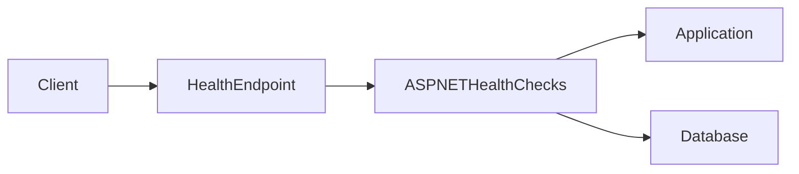

# Health Checks

## Table of Contents

* [1. Overview](#1-overview)
* [2. Architecture](#2-architecture)
* [3. Health Check Endpoints](#3-health-check-endpoints)
* [4. Application Health Checks](#4-application-health-checks)
* [5. Operational Usage](#5-operational-usage)

---

# 1. Overview

This template includes **health checks** to allow clients or development tooling to determine whether the service is running and able to access its required dependencies.

Health checks help verify two important aspects of a service:

* whether the **application process is running**
* whether the service is **ready to handle requests**

These concerns are separated into two different checks:

* **liveness checks** – confirm that the application is running
* **readiness checks** – confirm that required dependencies are available

Separating these checks allows the application to indicate when it is operational but temporarily unable to serve requests due to dependency failures.

Health checks are implemented using the **ASP.NET Core Health Checks framework** and are exposed through HTTP endpoints.

---

# 2. Architecture

Health checks are registered during application startup and exposed through HTTP endpoints.

When a health endpoint is called, ASP.NET Core executes the registered checks and returns a response indicating whether the service is healthy.



The health check system evaluates each registered check and returns a status indicating whether the service is healthy.

This allows external systems or development tools to verify the operational state of the application.

---

# 3. Health Check Endpoints

The application exposes two health check endpoints.

| Endpoint        | Purpose                                                    |
| --------------- | ---------------------------------------------------------- |
| `/health/live`  | Verifies that the application process is running           |
| `/health/ready` | Verifies that the service can access required dependencies |

---

### Liveness Endpoint

```
GET /health/live
```

This endpoint confirms that the application process is running and able to respond to HTTP requests.

The liveness check is intentionally lightweight and does not validate external dependencies.

If this endpoint fails, it indicates that the application process itself is not functioning correctly.

---

### Readiness Endpoint

```
GET /health/ready
```

The readiness endpoint verifies that the service can access the dependencies required to process requests.

If a readiness check fails, the application is still running but may not be able to serve requests successfully.

---

# 4. Application Health Checks

Health checks are registered during application startup.

```csharp
builder.Services.AddHealthChecks()
    .AddCheck("self", () => HealthCheckResult.Healthy(), tags: ["live"])
    .AddDbContextCheck<AppDbContext>(tags: ["ready"]);
```

Two checks are configured in the template.

---

### Self Check (Liveness)

The **self check** verifies that the application process is running.

```csharp
.AddCheck("self", () => HealthCheckResult.Healthy(), tags: ["live"])
```

This check always returns a healthy result if the application is operational.

It is used by the `/health/live` endpoint.

---

### Database Check (Readiness)

The readiness check verifies that the application can access the database.

```csharp
.AddDbContextCheck<AppDbContext>(tags: ["ready"])
```

This check attempts to validate the database connection used by the application's `DbContext`.

If the database cannot be reached, the readiness endpoint will return an unhealthy result.

This indicates that the service may not be able to process requests that depend on the database.

---

### Endpoint Mapping

Health checks are mapped to HTTP endpoints during application startup.

```csharp
app.MapHealthChecks("/health/live", new HealthCheckOptions
{
    Predicate = r => r.Tags.Contains("live")
});

app.MapHealthChecks("/health/ready", new HealthCheckOptions
{
    Predicate = r => r.Tags.Contains("ready")
});
```

Each endpoint filters the registered health checks using tags.

This ensures that:

* the **liveness endpoint** executes only liveness checks
* the **readiness endpoint** executes only dependency checks

---

# 5. Operational Usage

Health endpoints provide a simple way to verify the operational state of the application.

During development, these endpoints can be used to confirm that the application and its dependencies are functioning correctly.

For example:

```
GET /health/live
```

returns a successful response if the application is running.

```
GET /health/ready
```

returns a healthy response only if the application can access its database.

Health checks are intentionally lightweight and should avoid performing expensive operations. Their purpose is to quickly determine whether the service is capable of handling requests.

By separating liveness and readiness checks, the application can communicate its operational state more accurately while keeping the health check system simple and predictable.
