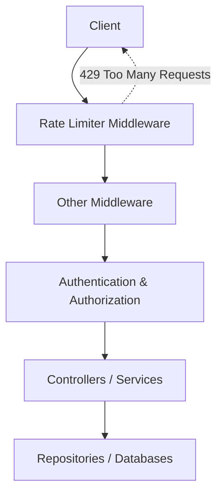

# Rate Limiting

## Table of Contents

* [1. Overview](#1-overview)  
* [2. Architecture](#2-architecture)  
* [3. Implementation](#3-implementation)  
* [4. Pipeline Integration](#4-pipeline-integration)  
* [5. Configuration](#5-configuration)  
* [6. Development vs Production Usage](#6-development-vs-production-usage)  
* [7. Potential Improvements](#7-potential-improvements)  
* [8. Caveats and Disadvantages](#8-caveats-and-disadvantages)  
* [9. Alternatives in Production](#9-alternatives-in-production)  

---

## 1. Overview

Rate limiting is a **critical mechanism** to control traffic to your API. It ensures that:

* Clients cannot overwhelm the system by sending excessive requests.  
* Downstream dependencies (databases, caches, external services) are protected from spikes.  
* The API provides fair usage to all clients, avoiding a single client monopolizing resources.  
* System stability, reliability, and predictable performance are maintained, particularly in public-facing or multi-tenant applications.

This template uses **ASP.NET Core’s built-in rate limiting middleware**, configured with a **fixed-window policy**. This provides a simple and effective way to throttle requests globally.

> **Why this approach?**  
> Fixed-window rate limiting is straightforward, requires no external dependencies, and integrates seamlessly with ASP.NET Core. For development, it allows teams to observe potential traffic spikes without blocking normal workflows.

---

## 2. Architecture

Rate limiting sits **early in the request pipeline**, protecting downstream components such as authentication, controllers, and services.  



**Explanation:**

* The middleware **intercepts all incoming requests** before they reach controllers.  
* It counts requests per client (or global in this template) within a defined time window.  
* Requests exceeding the limit are **immediately rejected** with `HTTP 429 Too Many Requests`.  
* Allowed requests continue through authentication, middleware, and eventually reach controllers.  

This architecture ensures that **resource-intensive operations are not performed** for clients exceeding the limits, saving CPU, memory, and database connections.

---

## 3. Implementation

The rate limiter in this template uses a **fixed-window policy** applied globally:

```csharp
public static IServiceCollection AddRateLimit(this IServiceCollection services)
{
    services.AddRateLimiter(options =>
    {
        options.AddFixedWindowLimiter("global", limiterOptions =>
        {
            limiterOptions.PermitLimit = 100; // max requests per window
            limiterOptions.Window = TimeSpan.FromMinutes(1); // window duration
            limiterOptions.QueueLimit = 0; // do not queue excess requests
            limiterOptions.QueueProcessingOrder = QueueProcessingOrder.OldestFirst;
        });
    });
    return services;
}
```

**Behavior:**

* Each client (or globally) can make up to **100 requests per minute**.  
* Requests above this threshold are **immediately rejected** with a 429 response.  
* No queuing is performed (`QueueLimit = 0`), avoiding delayed requests that could overload downstream services.  

These numbers are **defaults for development and demonstration purposes**. Production environments should tune them based on real traffic patterns, SLAs, and abuse protection needs.

---

## 4. Pipeline Integration

The middleware is integrated into the request pipeline as follows:

```csharp
app.UseRateLimiter();
app.MapControllers().RequireRateLimiting("global");
```

* `UseRateLimiter()` registers the middleware to intercept all requests.  
* `RequireRateLimiting("global")` ensures that **all controllers and endpoints** are protected under the global policy.  

This design ensures **consistency**: no controller accidentally bypasses the rate limiter. In production, you may also combine middleware with **API gateway rate limiting** for distributed deployments.

---

## 5. Configuration

Key configuration parameters:

* **PermitLimit** – maximum number of requests allowed per window.  
* **Window** – the duration of the time window for counting requests.  
* **QueueLimit** – number of requests allowed to wait when the limit is reached.  
* **QueueProcessingOrder** – order in which queued requests are processed (FIFO/LIFO).  

Example:

```json
{
  "RateLimiting": {
    "PermitLimit": 100,
    "WindowMinutes": 1,
    "QueueLimit": 0
  }
}
```

> These settings are suitable for development or small-scale testing. Production-grade systems may require **sliding window, token bucket, or distributed policies** for smoother enforcement.

---

## 6. Development vs Production Usage

**Development:**

* Rate limiting can be **relaxed or disabled** locally to avoid interfering with tests, debugging, or local integration.  
* Adding it in development helps identify **client-side flooding issues** early.  
* Enables teams to **verify logging and metrics** for rejected requests.

**Production:**

* Must be **carefully tuned** based on traffic, SLA, and endpoint criticality.  
* Protects downstream dependencies from overload and helps **maintain consistent API behavior**.  
* May need **per-client or per-endpoint policies** rather than a single global limit.  

> Always monitor rate limiting events in production to ensure legitimate clients are not blocked unnecessarily.

---

## 7. Potential Improvements

While the current template provides a **basic fixed-window limiter**, production environments often require:

* **Sliding window or token bucket algorithms** – to smooth bursty traffic and reduce “window-edge spikes”.  
* **Distributed rate limiting** – using Redis or other centralized stores for multi-instance deployments.  
* **Custom policies per client or endpoint** – internal vs external users may have different limits.  
* **Retry headers (`Retry-After`)** – help clients adjust their request rate after rejection.  
* **Dynamic rate limiting** – adjust limits based on system load or resource usage in real time.

These improvements increase **resilience, fairness, and usability** for end users.

---

## 8. Caveats and Disadvantages

Even with basic rate limiting, there are trade-offs:

* **Legitimate clients may be blocked** if limits are too strict.  
* **Testing complexity** – in local development, limits can interfere with automated tests or integration scenarios.  
* **Additional latency** – if queuing is used, requests may be delayed.  
* **Operational overhead** – distributed policies require monitoring and infrastructure (e.g., Redis).  

Always **tune rate limits carefully** and consider monitoring rejected requests to adjust policies proactively.

---

## 9. Alternatives in Production

In production, the built-in middleware can be **replaced or complemented** by external systems:

* **API Gateways** (e.g., Azure API Management, Kong, NGINX, Traefik) – can enforce distributed, per-client limits.  
* **Cloud-managed services** – provide automatic throttling, retry headers, and reporting.  
* **Custom distributed middleware** – integrated with Redis or other stores for centralized counters.  

> This template’s built-in middleware is suitable for **development and simple deployments**, but production may require more sophisticated enforcement for **scale, multi-instance coordination, and observability**.

