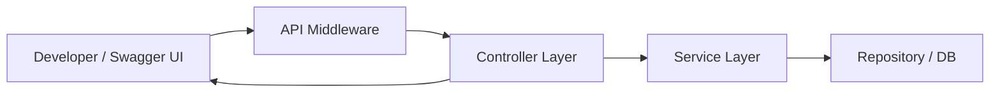
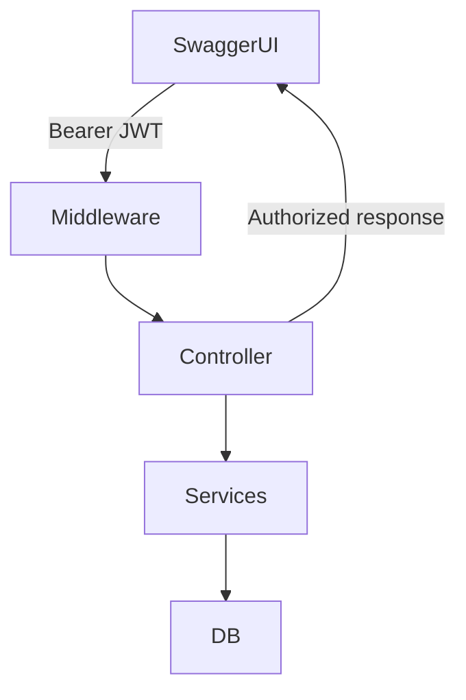
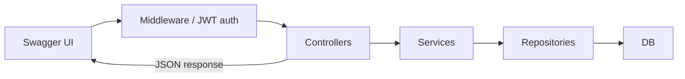

# Swagger / OpenAPI Documentation

## Table of Contents

* [1. Overview](#1-overview)  
* [2. Purpose and Benefits](#2-purpose-and-benefits)  
* [3. Architecture](#3-architecture)  
* [4. Implementation Highlights](#4-implementation-highlights)  
* [5. Authentication and Authorization Support](#5-authentication-and-authorization-support)  
* [6. JSON Enum Serialization](#6-json-enum-serialization)  
* [7. Pipeline Integration](#7-pipeline-integration)  
* [8. Development vs Production Usage](#8-development-vs-production-usage)  
* [9. Potential Improvements](#9-potential-improvements)  
* [10. Best Practices](#10-best-practices)  

---

## 1. Overview

Swagger (OpenAPI) provides a **standardized, interactive API documentation platform**.  

In this template, Swagger is used in **both `ServiceName` and `SampleAuthService`**:

* To **document all endpoints** automatically  
* To allow **developers and QA** to test endpoints interactively  
* To integrate with **JWT Bearer authentication**  
* To ensure API contracts are **human-readable and predictable**, especially with enums  

This ensures that any developer consuming the API can understand the endpoints, request/response models, and authentication requirements **without reading the source code**.  

---

## 2. Purpose and Benefits

Key reasons for integrating Swagger:

1. **Developer Productivity** – interactive API docs reduce onboarding time.  
2. **Self-testing** – allows developers to send requests directly from the UI with JWTs.  
3. **Human-readable contracts** – enums serialized as strings (`"Admin"`) instead of numeric values (`2`).  
4. **Standardization** – promotes consistent API structure across services.  
5. **Compatibility** – can later integrate with API portals or CI/CD documentation pipelines.  

Benefits for engineers and recruiters:

* Quickly understand API capabilities without code deep-dive  
* Verify **JWT-secured endpoints** are correctly configured  
* Visualize API flow, contracts, and enum values  

---

## 3. Architecture

Swagger sits as **middleware in the ASP.NET Core pipeline**, integrated before controllers.



**Flow Explanation**:

* Swagger UI sends requests (optionally with JWT)  
* Middleware routes to controllers and downstream services  
* Responses are formatted in JSON, including **enums as strings**  
* Developers see **live responses** and can debug without external tools  

This architecture ensures that documentation **mirrors real API behavior**, making it a trustworthy source for testing.  

---

## 4. Implementation Highlights

### Swagger Registration

Each service registers Swagger through an extension method:

```csharp
services.AddSwaggerGen(options =>
{
    options.SwaggerDoc("v1", new OpenApiInfo
    {
        Title = "ServiceName API",
        Version = "v1"
    });

    // JWT support
    options.AddSecurityDefinition("Bearer", new OpenApiSecurityScheme
    {
        Name = "Authorization",
        Type = SecuritySchemeType.Http,
        In = ParameterLocation.Header,
        Scheme = "bearer",
        Description = "Enter: Bearer {your JWT token}",
        BearerFormat = "JWT"
    });

    options.AddSecurityRequirement(new OpenApiSecurityRequirement { /* ... */ });
});
```

* **Title and Version** – uniquely identifies the service and API version  
* **Security Definition** – enables sending JWT tokens from Swagger UI  
* **Security Requirement** – applies JWT globally for endpoints that require authentication  

---

## 5. Authentication and Authorization Support

* Swagger **does not implement security**, it only supports testing authenticated endpoints.  
* JWT input in UI aligns with your **authentication and authorization pipeline**.  
* Helps developers verify **role-based access** and permissions in a live environment.  

High-level flow:



* Requests with missing or invalid JWT return **401 Unauthorized**.  
* Requests with valid JWTs return **success or role-specific errors**.  

> Detailed authentication/authorization rules are covered in `authentication.md`.

---

## 6. JSON Enum Serialization

**SampleAuthService** uses enums for roles and other domain concepts:

```csharp
public enum UserRole
{
    ReadUser,
    WriteUser,
    Admin
}
```

* By default, .NET serializes enums as integers (0, 1, 2).  
* Swagger configuration and controller options serialize enums as **strings**, making the API contract human-readable:

```csharp
options.JsonSerializerOptions.Converters
    .Add(new JsonStringEnumConverter());
```

Example JSON response:

```json
{
  "username": "john.doe",
  "role": "Admin"
}
```

**Benefits**:

* Reduces client confusion  
* Avoids mistakes when integrating with front-end or other services  
* Makes API contracts **self-documenting**  

---

## 7. Pipeline Integration

* Swagger is **enabled in development environment only**:

```csharp
if (app.Environment.IsDevelopment())
{
    app.UseSwagger();
    app.UseSwaggerUI(options =>
    {
        options.SwaggerEndpoint("/swagger/v1/swagger.json", "ServiceName API v1");
    });
}
```

* Requests flow through:



* Middleware captures exceptions, logs requests, and formats responses.  
* Enum values are serialized as strings, JWT-protected endpoints are supported.  

---

## 8. Development vs Production Usage

* **Development**:

  * Full interactive Swagger UI  
  * JWT testing enabled  
  * Enum values readable  
  * Helps QA, integration testing, and onboarding  

* **Production**:

  * Swagger UI often **disabled** for security reasons  
  * API documentation may be replaced with **centralized portals**  
  * Could integrate with **API gateway documentation** or **OpenAPI portal**  
  * JWT and enum behavior remains consistent in real API responses  

> The template keeps Swagger lightweight for dev, but production-grade API docs may use **external documentation services**.  

---

## 9. Potential Improvements

1. **API Versioning** – multiple Swagger docs for v1, v2, etc.  
2. **XML comments & endpoint examples** – improve clarity for consumers.  
3. **Filtering internal/admin endpoints** – reduce exposure in dev portals.  
4. **External API documentation portals** – consolidate docs across services.  
5. **Custom security schemes** – OAuth2, OpenID Connect for enterprise-grade auth.  
6. **Auto-generated client SDKs** – from Swagger/OpenAPI spec for front-end or external integrations.  

---

## 10. Best Practices

* Keep Swagger **enabled only for non-production environments**  
* Always align **JWT security definitions** with your auth pipeline  
* Serialize enums as **strings** for readability and consistency  
* Validate **role-based access** during testing with Swagger UI  
* Consider **rate-limiting and exception handling** when exposing Swagger to dev teams  
