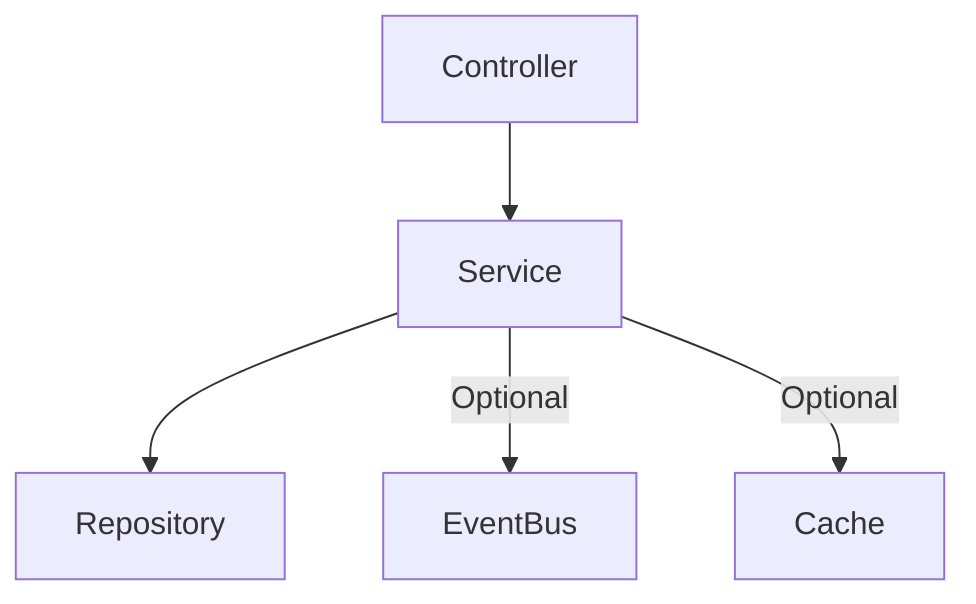
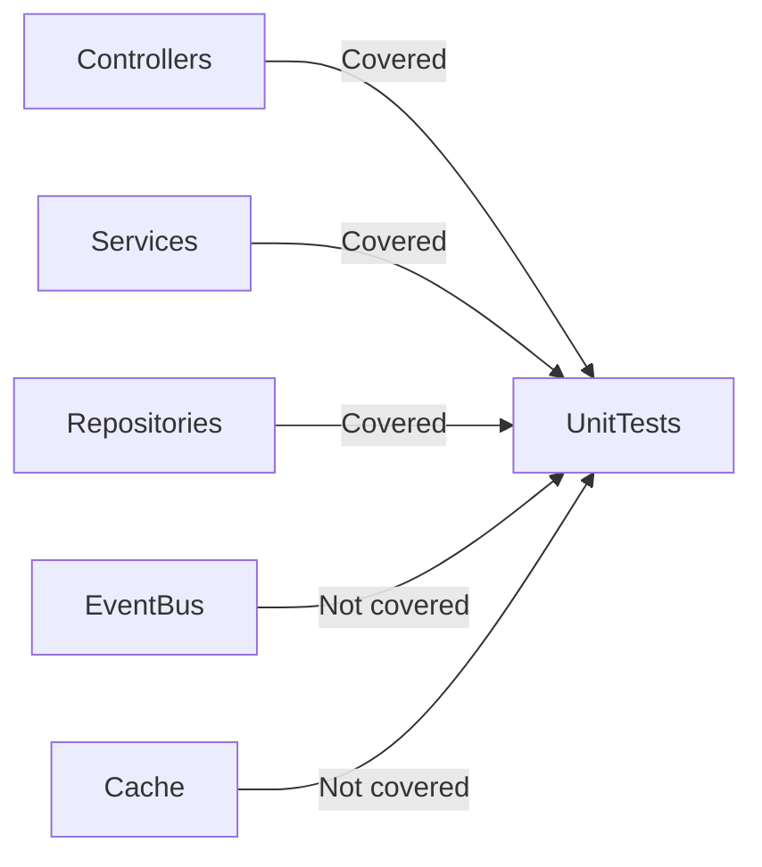

# Unit Testing in Microservice Template

This document explains the **unit testing approach implemented in this microservice-template**. It describes **what tests exist**, **why they were added**, and **how to extend the template for new cases**.

> This is a **minimal template** for unit testing. It is enough to validate controllers, services, and repositories. Tests for caching and event publishing are **not included**, but can be added later.

---

## 1. Why We Need Unit Tests

Unit tests in this template are intended to:

* Verify **business logic correctness** in services.
* Ensure **controllers return expected HTTP responses**.
* Check **repositories handle CRUD operations correctly**.
* Provide a **baseline for coverage**.

**Diagram: Layer coverage**



* Controllers, services, repositories are tested.
* EventBus and cache are **not covered**, but developers can extend tests to include them.

---

## 2. Test Files Overview

### 2.1 Controllers

* **Purpose:** Ensure API endpoints return correct HTTP status and call services correctly.
* **Files:**

  * `SampleControllerTests.cs`
  * `UserControllerTests.cs`
  * `TokenControllerTests.cs`

**Example:**

```csharp
[Fact]
public async Task GetByIdAsync_Should_Return_Ok_When_Found()
{
    var id = Guid.NewGuid();
    var dto = new GetSampleRequestDto();

    _mockService.Setup(s => s.GetByIdAsync(id)).ReturnsAsync(dto);

    var result = await _controller.GetByIdAsync(id);

    Assert.IsType<OkObjectResult>(result);
}
```

**What was done:**

* Methods are called with **mocked services**.
* Returns are asserted to match expected HTTP status (`Ok`, `NotFound`, `Forbid`).
* Service methods are **verified** to be called with correct parameters.

---

### 2.2 Services

* **Purpose:** Test business logic, DTO ↔ Entity mapping, and repository calls.
* **Files:**

  * `SampleServiceTests.cs`
  * `UserServiceTests.cs`
  * `TokenServiceTests.cs`

**Example:**

```csharp
[Fact]
public async Task AddAsync_Creates_Entity_And_Calls_Repository()
{
    var dto = new AddSampleRequestDto { Name = "New" };

    SampleEntity? saved = null;

    _repoMock
        .Setup(r => r.AddAsync(It.IsAny<SampleEntity>(), It.IsAny<CancellationToken>()))
        .Callback<SampleEntity, CancellationToken>((e, _) => saved = e)
        .Returns(Task.CompletedTask);

    await _service.AddAsync(dto);

    Assert.NotNull(saved);
    Assert.Equal("New", saved!.Name);
}
```

**What was done:**

* Service methods are called with **mocked repositories**.
* DTOs are **mapped to entities** and verified.
* Repository methods are **verified for correct parameters**.
* Exceptions are tested for **invalid inputs**.

**Note:** Cache and EventBus are not tested here but can be added later.

---

### 2.3 Repositories

* **Purpose:** Validate database operations.
* **Files:**

  * `SampleRepositoryTests.cs`
  * `UserRepositoryTests.cs`

**Example:**

```csharp
[Fact]
public async Task AddAsync_Should_Save_Entity()
{
    var entity = new SampleEntity { Id = Guid.NewGuid(), Name = "Test" };
    await _repo.AddAsync(entity);

    var saved = await _context.SampleEntities.FirstOrDefaultAsync();
    Assert.Equal("Test", saved!.Name);
}
```

**What was done:**

* **In-memory databases** are used (`SQLite` or `InMemoryDb`).
* CRUD operations are tested for **success and failure cases**.
* Edge cases (like deleting non-existent entity) are included.

---

## 3. How Test Cases Were Created

1. Identify **unit of work** (method in controller/service/repository).
2. Decide **expected behavior**: success, not found, exception.
3. Use **AAA pattern**:

   * Arrange: create input and mocks.
   * Act: call the method.
   * Assert: verify output and side effects.
4. Verify **mocked dependencies** (repositories, services) were called correctly.
5. Keep tests **small and independent**.

---

## 4. When Not to Add Tests

* For **simple DTOs/models with no logic**.
* For **auto-generated code** or third-party wrappers.
* For **external systems** (use integration tests instead).

---

## 5. Code Coverage Guidance

* Current template covers: **controllers, services, repositories**.
* Optional coverage to add later: **EventBus and cache interactions**.
* Use **Coverlet or VS code coverage** to check missing coverage.
* Missing tests are generally for **infrastructure or trivial DTOs**, which is acceptable in this minimal template.

**Diagram: Coverage status**



